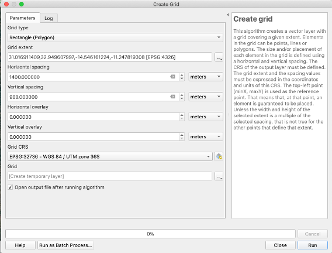
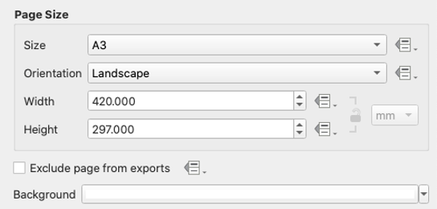
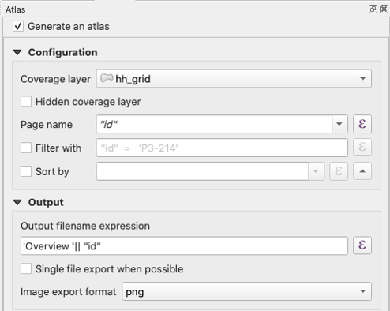
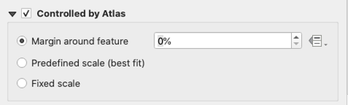
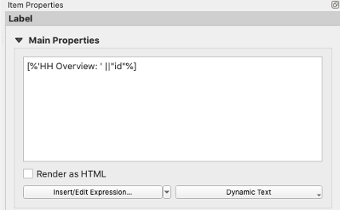
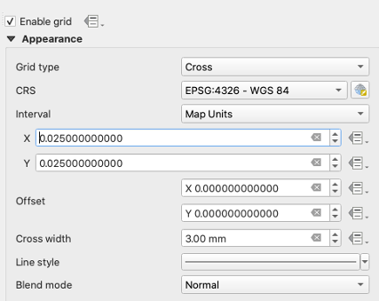
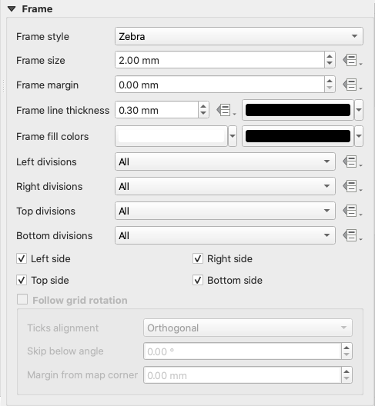
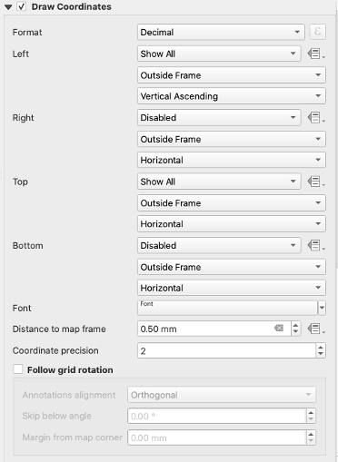
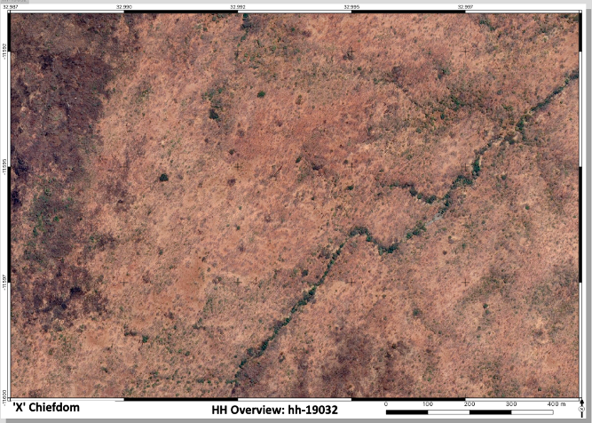

# HH Sheets
_HH Sheets are used to systematically cover the area of land documentation so parcels can be hand drawn, and later digitized. Each sheet is a rectangle of a satellite layer so features can be easily identified and used to hand draw parcels._ 

## Create HH Grid
- ILRG already has a grid set up, but if you need to cover a new area you can set up one from scratch.
- Use the 'Create grid' tool under 'Vector Creation' in the 'Processing Toolbox'.
- Set the following properties: 
    - Grid type: Rectangle (Polygon)
    - Grid Extent: Calculate from Layer > Chiefdoms
    - Horizontal Spacing: should be about 1400m
    - Vertical Spacing: should be about 900m


## Load in Necessary Layers
- Load in hh_grid from the ilrg_fzs public schema.
- Load in google satellite base layer from XYZ tiles in the 'Browser' panel.
    - More details on adding this base layer are in the [PostGIS](MonitoringTools.html) section of the documentation.

## Set Up and Configure Print Layout
- The point of HH Sheets is to systematically cover the area of land documentation so parcels can be hand drawn, and later digitized. Thus, most of the work for setting them up is done in a print layout. 
- Right click after opening print layout, set page properties, ‘Size’ should be set to ‘A3’ and ‘Orientation’ should be ‘Landscape’.


- Use the map tool to draw a map that is about the size of the print layout.
- Configure atlas with the following properties, make sure to check the box next to ‘Generate an atlas’: 


- Go to the map's 'Item Properties'.
- Check 'Controlled by Atlas' and set the 'Margin around feature' to 0%.


- Add a text label based on the Chiefdom for which you are creating HH Sheets.
- Add a text label to the map: ``` [%'HH Overview: ' ||"id"%] ```


- Add a scale and set it to be in meters.
- Grid attributes: you may need to change the 'Interval' X and Y as needed based on the size of HH grid you are creating. 





- The end product should look something like this:



**[Previous](Parcel_Handling.html)** <> **[Next](MonitoringTools.html)**
