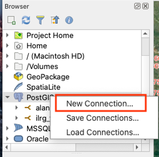

# Connecting to PostGIS on QGIS
QGIS is a free, open source, desktop geographic information system application. All of the geospatial based data management for the ILRG project is conducted in the monitoring_tool QGIS project. The geospatial layers in this project come from a database. You need to have user permissions for the postgreSQL databases that hold the update and public schema.

- Start by opening QGIS, then under the browser panel, right click on 'PostGIS', and then 'New Connection...'

- A new panel will pop up and should be filled out with the following information:
    - Name: choose a name that corresponds to the database you are connecting to
    - Service: leave blank
    - Host: the IP address for the EC2 instance
    - Port: 5432
    - Database: name of the postgreSQL database you are connecting to
    - Authentication: choose basic, then enter your username and password
- Test your connection to make sure your information is correct, you should see a blue banner on the top of the panel that says the connection was successful
- Choose to also list tables with no geometry, then hit OK
- Under PostGIS in the Browser panel, you should see your new database connection
- To view the tables in the database, go to 'Database' and then 'DB Manager'
- for example, the ilrg_fzs database has three schemas: odk_prod, public and update
    - the update schema is where the data first goes from ODK Central, and where the data is cleaned
    - the public schema is where the clean data lives
    - _Almost all of the data layers should come from the public schema, NOT the update schema. The only exception is the form_e1_parcels layer that has not been completely validated yet_

### Load the following layers from the database (required for the digitization and validation process):
**This also represents an overview of the monitoring tools QGIS project for the ILRG project.**
- form_a1_village_identification (from the pubilc schema): point results from Form A1 Village Identification
    - points represent validated villages, these villages are validated in a previous process in Access and QGIS
    - each point contains pertaining to shared resources, access to electricity, primary schools, public transit etc., as well as whether the village is recognized by the chief, and has a village register
- form_i1_meeting (from the public schema):
    - location of meeting with village representatives, , includes attributes like the type of meeting (First village meeting, land use planning, shared resources meeting, etc), details if there was a conflict, photos and observations
- table_enumerator (from the public schema): non-spatial layer with the name and role of the project's enumerators/data collectors
- form_e1_demarcation (from the public schema):
    - point layer representing the point of demarcation, labelled by the tech who surveyed the parcel concatenated with the parcel ID (if not labelled already, do so now)
        - parcel IDs are designated incrementally in the field and are not based on the HH id/sheet id as each grid can contain multiple parcels
        - the tech records a demarcation point (location of the geospatial points in this layer) within the parcel, but also records the location of access (this point does not represent the location of access, this would need to be visualized separately)
        - the form also records other information such as the land use, land cover, etc.
        - importantly, the form contains fields for the witness, and requires the upload of the hand drawn boundaries of the parcel on the HH mapsheet (this picture is georeferenced, and the boundaries digitized to form the parcels)
- parcels (from the public schema):
    - digitized parcels from images of HH mapsheet from form_e1_demarcation
    - these parcels are digitized in this QGIS project under form_e1_parcels, once these parcels are validated, they are moved into the parcels layer
- form_e1_parcels (from the update schema):
    - digitized parcels from form_e1_parcels that have not been verified yet, yellow parcels have been digitized but not verified, red parcels have been both digitized and verified
    - when parcels are verified, the checked column in the attribute table is changed from ‘no’ to ‘yes’, an update SQL script is run several times a day that moves the verified and checked parcels onto the public schema onto the public schema
- form_d2_shared_resources_dig_line (from the public schema):
    - digitized lines of shared resources documented in form D2, these resources are documented through the form as GPS coordinates of the boundaries, or they are drawn on printed mapsheets, and then [georeferenced and digitized](Digitization_Validation.html)
        - the mapsheets have reference numbers, allowing for easy georeferencing and digitization
    - examples include river, roads, and streams
- form_d2_shared_resource_digitization (from the public schema):
    - digitized polygon layer of shared resources documented in form D2, these resources are documented through the form as GPS coordinates of the boundaries, or they are drawn on printed mapsheets, and then georeferenced and digitized
    - examples include agriculture, bush, hill, lagoon, mountain, reserved land, etc.
- OSM standard: raster layer, available through quick map services with an API key
- Google Satellite:
    - add a google satellite layer through XYZ tiles
    - in the QGIS browser panel, find the XYZ tiles section, then right click on 'XYZ Tiles', and click on 'New Connection'
    - in the new pop-up window, enter the name Google Satellite and use the url: https://www.google.cn/maps/vt?lyrs=s@189&gl=cn&x={x}&y={y}&z={z}
    - Then click ok, now you can add the Google Satellite basemap to the project, either by dragging it from the browser panel, or adding it form the QGIS Data Source Manager

**[Previous](HH_Sheets.html)** <> **[Next](Digitization_Validation.html)**
