# Monitoring Data in Excel
_Monitoring data and checking for errors is also done in excel through fzs_monitoring_tool.xlsx. Ask the database administrator for the ILRG project's populated excel tool, but this guide will also go over how to create one from scratch._

## Purpose
- Loads in data from the update and public schema.
- Used to spot errors and monitor which parcels need certification. 
- General interface to monitor the status of the data and the progress of validating claims, parties and the OCC (Objection, Correction and Certification) process.

## Structure
We will set up the following data sheets in excel:
- error_spotter
- Enumerators
- weekly_progres
- Master Sheet
- table_enumerator
- villages
- demarcations
- validated_claims
- unvalidated_claims
- validated_parcels
- unvalidated_parcels
- validated_parties
- unvalidated_parties
- OCC Parcel Ready to Certify
- OCC Parcel Not Ready to Certify 

## Add Data from Database to Excel Sheet
**- Data is connected to the SQL database through ODBC drivers**
- First you need to install ODBC on your computer (follow the [instructions](https://learn.microsoft.com/en-us/sql/connect/odbc/download-odbc-driver-for-sql-server?view=sql-server-ver16) relevant to your device).
- On mac, run the following command in your terminal: 
```
/bin/bash -c "$(curl -fsSL https://raw.githubusercontent.com/Homebrew/install/master/install.sh)"
brew tap microsoft/mssql-release https://github.com/Microsoft/homebrew-mssql-release
brew update
HOMEBREW_ACCEPT_EULA=Y brew install msodbcsql17 mssql-tools
```
- For each set of data (each sheet), you need to:
    - Open a new sheet
    - Go to Data > Get Data (Power Query) > From SQL Server ODBC
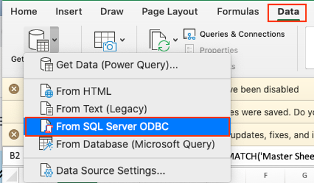

    - In the 'From ODBC' pop up, set the following:
        - Data source name (DSN): ilrg_fzs
        - Connection string (replace username and password with your credentials for the PostgreSQL database): 
        ```
        DSN=ilrg_fzs;DATABASE=ilrg_fzs;SERVER=13.244.91.45;PORT=5432;UID=USERNAME;PWD=PASSWORD
        ```

## Add SQL Statements 
- You will need to go through the _Add Data from Database to Excel Sheet_ steps multiple times, and use a different SQL command for each set of data. _Each sheet has a different source/query._
**- Use the following SQL scripts for each sheet:**
    - village: 
    ```
    SELECT table_village.id, table_village.code, 
    table_village.village, table_village.vag, table_village.jurisdiction
    FROM public.table_village table_village
    ```
    - table_enumerator: 
    ```
    SELECT table_enumerator.id, table_enumerator.code, 
    table_enumerator.family_name, table_enumerator.given_name, 
    table_enumerator.gender, table_enumerator.role, table_enumerator.tel_1, 
    table_enumerator.name
    FROM public.table_enumerator table_enumerator
    ```
    - demarcations:
    ```
    SELECT form_e1_demarcation.geom, form_e1_demarcation.altitude, 
    form_e1_demarcation.accuracy, form_e1_demarcation.tech_name, 
    form_e1_demarcation.date, form_e1_demarcation.jurisdiction, 
    form_e1_demarcation.vag, form_e1_demarcation.village, 
    form_e1_demarcation.table_state_label, form_e1_demarcation.state_note, form_e1_demarcation.access, 
    form_e1_demarcation.parcel_access_gps_latitude, 
    form_e1_demarcation.parcel_access_gps_longitude, 
    form_e1_demarcation.parcel_access_gps_altitude, form_e1_demarcation.parcel_access_gps_accuracy, 
    form_e1_demarcation.parcel_id, form_e1_demarcation.parcel_id_chk, 
    form_e1_demarcation.parcel, form_e1_demarcation.table_land_use_label, 
    form_e1_demarcation.table_land_cover_label, form_e1_demarcation.label, 
    form_e1_demarcation.poly_map_id, form_e1_demarcation.map_sheet_number, 
    form_e1_demarcation.map_sheet_number_confirm, form_e1_demarcation.conflict_y_n, form_e1_demarcation.conflic_resolved, 
    form_e1_demarcation.conflict_description, form_e1_demarcation.border, 
    form_e1_demarcation.overlap, form_e1_demarcation.beacons, form_e1_demarcation.water_label, 
    form_e1_demarcation.infrastructure, form_e1_demarcation.land_category, 
    form_e1_demarcation.holder_given_name, form_e1_demarcation.holder_family_name, 
    form_e1_demarcation.holder_gender, form_e1_demarcation.holder_youth, 
    form_e1_demarcation.representative_given_name, form_e1_demarcation.representative_family_name, 
    form_e1_demarcation.rep_gender, form_e1_demarcation.rep_youth, 
    form_e1_demarcation.rep_relation, form_e1_demarcation.entity_type, form_e1_demarcation.entity_name, 
    form_e1_demarcation.witnesses_image, form_e1_demarcation.receipt_image, 
    form_e1_demarcation.map_sheet_image, form_e1_demarcation.key, form_e1_demarcation.zone
    FROM public.form_e1_demarcation form_e1_demarcation
    ```
    - validated_claims:
    ```
    SELECT form_e2_claims.tec_name, form_e2_claims.date, 
    form_e2_claims.jurisdiction, form_e2_claims.vag, 
    form_e2_claims.parcel_id, form_e2_claims.parcel_id_chk, 
    form_e2_claims.parcel, form_e2_claims.land_category, 
    form_e2_claims.evidence, form_e2_claims.document_type, 
    form_e2_claims.document_authority, form_e2_claims.document_present, 
    form_e2_claims.document_owner, form_e2_claims.document_spatial, 
    form_e2_claims.document_date, form_e2_claims.document_number, 
    form_e2_claims.document_photo_1, form_e2_claims.document_photo_2, 
    form_e2_claims.comment, form_e2_claims.claim_image, 
    form_e2_claims.key, form_e2_claims.date_checked
    FROM public.form_e2_claims form_e2_claims
    ```
    - validated_parcels:
    ```
    SELECT parcels.geom, parcels.parcel_id, parcels.parcel, 
    parcels.x_min, parcels.x_max, parcels.y_min, parcels.y_max, 
    parcels.key, parcels.date_checked
    FROM public.parcels parcels
    ```
    - validated_parties:
    ```
    SELECT form_e2_claims_parties.parcel_parties, form_e2_claims_parties.party_role, 
    form_e2_claims_parties.relationship, form_e2_claims_parties.tenure_acquisition, 
    form_e2_claims_parties.tenure_responsibilities, form_e2_claims_parties.tenure_restrictions, 
    form_e2_claims_parties.tenure_rights, form_e2_claims_parties.tenure_status, 
    form_e2_claims_parties.witness_relationship, form_e2_claims_parties.prefix_name, 
    form_e2_claims_parties.given_name, form_e2_claims_parties.middle_name, 
    form_e2_claims_parties.family_name, form_e2_claims_parties.suffix_name, 
    form_e2_claims_parties.gender, form_e2_claims_parties.civil_status, 
    form_e2_claims_parties.birthdate, form_e2_claims_parties.year_of_birth, 
    form_e2_claims_parties.age_range, form_e2_claims_parties.nationality, 
    form_e2_claims_parties.party_photo, form_e2_claims_parties.id_type, 
    form_e2_claims_parties.nrc_number, form_e2_claims_parties.passport_number, 
    form_e2_claims_parties.driving_licence, form_e2_claims_parties.formal_id, 
    form_e2_claims_parties.formal_id_number, form_e2_claims_parties.id_photo_front, 
    form_e2_claims_parties.id_photo_back, form_e2_claims_parties.address_type, 
    form_e2_claims_parties.province, form_e2_claims_parties.chiefdom, 
    form_e2_claims_parties.vag, form_e2_claims_parties.village_id, 
    form_e2_claims_parties.address_line_1, form_e2_claims_parties.address_line_2, 
    form_e2_claims_parties.address_town_or_city, form_e2_claims_parties.address_urban_province, 
    form_e2_claims_parties.primary_contact_zm, form_e2_claims_parties.primary_contact_in, 
    form_e2_claims_parties.secondary_contact_zm, form_e2_claims_parties.secondary_contact_in, 
    form_e2_claims_parties.email, form_e2_claims_parties.parent_key, 
    form_e2_claims_parties.key, form_e2_claims_parties.date_checked
    FROM public.form_e2_claims_parties form_e2_claims_parties
    ```
    - unvalidated_parties:
    ```
    SELECT form_e2_claims_parties.parcel_parties, form_e2_claims_parties.party_role, 
    form_e2_claims_parties.relationship, form_e2_claims_parties.tenure_acquisition, 
    form_e2_claims_parties.tenure_responsibilities, 
    form_e2_claims_parties.tenure_restrictions, 
    form_e2_claims_parties.tenure_rights, form_e2_claims_parties.tenure_status, 
    form_e2_claims_parties.witness_relationship, form_e2_claims_parties.prefix_name, 
    form_e2_claims_parties.given_name, form_e2_claims_parties.middle_name, 
    form_e2_claims_parties.family_name, form_e2_claims_parties.suffix_name, 
    form_e2_claims_parties.gender, form_e2_claims_parties.civil_status, 
    form_e2_claims_parties.birthdate, form_e2_claims_parties.year_of_birth, 
    form_e2_claims_parties.age_range, form_e2_claims_parties.nationality, 
    form_e2_claims_parties.party_photo, form_e2_claims_parties.id_type, 
    form_e2_claims_parties.nrc_number, form_e2_claims_parties.passport_number, 
    form_e2_claims_parties.driving_licence, form_e2_claims_parties.formal_id, 
    form_e2_claims_parties.formal_id_number, form_e2_claims_parties.id_photo_front, 
    form_e2_claims_parties.id_photo_back, form_e2_claims_parties.address_type, 
    form_e2_claims_parties.province, form_e2_claims_parties.chiefdom, 
    form_e2_claims_parties.vag, form_e2_claims_parties.village_id, 
    form_e2_claims_parties.address_line_1, form_e2_claims_parties.address_line_2, 
    form_e2_claims_parties.address_town_or_city, form_e2_claims_parties.address_urban_province, 
    form_e2_claims_parties.primary_contact_zm, form_e2_claims_parties.primary_contact_in, 
    form_e2_claims_parties.secondary_contact_zm, form_e2_claims_parties.secondary_contact_in, 
    form_e2_claims_parties.email, form_e2_claims_parties.parent_key, form_e2_claims_parties.key, 
    form_e2_claims_parties.checked, form_e2_claims_parties.date_checked
    FROM update.form_e2_claims_parties form_e2_claims_parties
    ```
    - OCC Parcel Ready to Certify:
    ```
    SELECT form_f1_occ.tec_name, form_f1_occ.date, form_f1_occ.jurisdiction, 
    form_f1_occ.vag, form_f1_occ.parcel_id, form_f1_occ.parcel_id_chk, 
    form_f1_occ.parcel, form_f1_occ.certified, form_f1_occ.cor_condition, 
    form_f1_occ.del_condition, form_f1_occ.add_condition, 
    form_f1_occ.bound_condition, form_f1_occ.sig_condition, 
    form_f1_occ.vil_condition, form_f1_occ.land_category, form_f1_occ.evidence, 
    form_f1_occ.document_type, form_f1_occ.document_oth, 
    form_f1_occ.document_authority, form_f1_occ.authority_other, 
    form_f1_occ.document_present, form_f1_occ.document_owner, 
    form_f1_occ.document_spatial, form_f1_occ.document_date, 
    form_f1_occ.document_number, form_f1_occ.document_photo_1, 
    form_f1_occ.document_photo_2, form_f1_occ.comment, form_f1_occ.conflict_reason, 
    form_f1_occ.conflict_obs, form_f1_occ.receipt_image, 
    form_f1_occ.village_id, form_f1_occ.headperson_signed, 
    form_f1_occ.vlc_signed, form_f1_occ.key
    FROM public.form_f1_occ form_f1_occ
    ```
    - OCC Parcel Not Ready to Certify:
    ```
    SELECT form_f1_occ.tec_name, form_f1_occ.date, form_f1_occ.jurisdiction, 
    form_f1_occ.vag, form_f1_occ.parcel_id, form_f1_occ.parcel_id_chk, 
    form_f1_occ.parcel, form_f1_occ.certified, form_f1_occ.cor_condition, 
    form_f1_occ.del_condition, form_f1_occ.add_condition, 
    form_f1_occ.bound_condition, form_f1_occ.sig_condition, form_f1_occ.vil_condition, 
    form_f1_occ.land_category, form_f1_occ.evidence, form_f1_occ.document_type, 
    form_f1_occ.document_oth, form_f1_occ.document_authority, 
    form_f1_occ.authority_other, form_f1_occ.document_present, 
    form_f1_occ.document_owner, form_f1_occ.document_spatial, 
    form_f1_occ.document_date, form_f1_occ.document_number, 
    form_f1_occ.document_photo_1, form_f1_occ.document_photo_2, form_f1_occ.comment, 
    form_f1_occ.conflict_reason, form_f1_occ.conflict_obs, form_f1_occ.receipt_image, 
    form_f1_occ.village_id, form_f1_occ.headperson_signed, 
    form_f1_occ.vlc_signed, form_f1_occ.key, form_f1_occ.checked
    FROM update.form_f1_occ form_f1_occ
    ```
    - certificates:
    ```
    SELECT certification.geom, certification.date_of_survey, 
    certification.jurisdiction, certification.vag, certification.village, 
    certification.parcel_id, certification.parcel, certification.date_digitized, 
    certification.produced, certification.area_hectares, certification.x_min, 
    certification.x_max, certification.y_min, certification.y_max, certification.key
    FROM public.certification certification
    ```
    - weekly_progress:
    ```
    SELECT form_e1_demarcation.geom, form_e1_demarcation.altitude, 
    form_e1_demarcation.accuracy, form_e1_demarcation.tech_name, 
    form_e1_demarcation.date, form_e1_demarcation.jurisdiction, 
    form_e1_demarcation.vag, form_e1_demarcation.village, 
    form_e1_demarcation.table_state_label, form_e1_demarcation.state_note, 
    form_e1_demarcation.access, form_e1_demarcation.parcel_access_gps_latitude, 
    form_e1_demarcation.parcel_access_gps_longitude, 
    form_e1_demarcation.parcel_access_gps_altitude, form_e1_demarcation.parcel_access_gps_accuracy, 
    form_e1_demarcation.parcel_id, form_e1_demarcation.parcel_id_chk, 
    form_e1_demarcation.parcel, form_e1_demarcation.table_land_use_label, 
    form_e1_demarcation.table_land_cover_label, form_e1_demarcation.label, 
    form_e1_demarcation.poly_map_id, form_e1_demarcation.map_sheet_number, 
    form_e1_demarcation.map_sheet_number_confirm, form_e1_demarcation.conflict_y_n, 
    form_e1_demarcation.conflic_resolved, form_e1_demarcation.conflict_description, 
    form_e1_demarcation.border, form_e1_demarcation.overlap, form_e1_demarcation.beacons, 
    form_e1_demarcation.water_label, form_e1_demarcation.infrastructure, 
    form_e1_demarcation.land_category, form_e1_demarcation.holder_given_name, 
    form_e1_demarcation.holder_family_name, form_e1_demarcation.holder_gender, 
    form_e1_demarcation.holder_youth, form_e1_demarcation.representative_given_name, 
    form_e1_demarcation.representative_family_name, form_e1_demarcation.rep_gender, 
    form_e1_demarcation.rep_youth, form_e1_demarcation.rep_relation, 
    form_e1_demarcation.entity_type, form_e1_demarcation.entity_name, 
    form_e1_demarcation.witnesses_image, form_e1_demarcation.receipt_image, 
    form_e1_demarcation.map_sheet_image, form_e1_demarcation.key
    FROM public.form_e1_demarcation form_e1_demarcation
    ```
_- Note the difference in SQL commands between validated/unvalidated and ready to certify/not ready to vertify is whether the data is coming from the update or public schema_

## Configure Data
### Properties of Data Connection
- You can find the properties of each sheet's database connection by going to 'Data' and then 'Properties'.

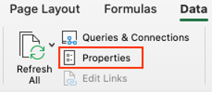
- Set external data properties to the following: 

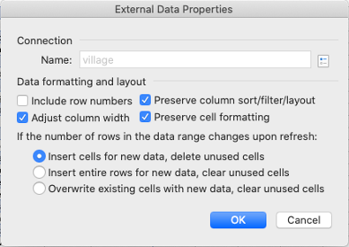

### Add Village Data for Joins
- The Master Sheet and Error Spotter sheet pull data from sheets by matching village names. But first, we need to add the village data to sheets by matching parcel ids to pull data from the demarcations sheet.
    - For validated_claims, unvalidated_claims, validated_parcels, unvalidated_parcels, OCC Parcel Ready to Certify, OCC Parcel Not Ready to Certify:
    ```
    =INDEX(demarcations!H:H,MATCH([@[parcel_id]],demarcations!P:P,0))
    ```
- There are some sheets that don’t get data from sql queries: unvalidated parcels, unvalidated claims, error spotter, enumerators, master sheet.
    - These sheets often pull field values from the sheets that do get data from sql queries, so **it is all connected**.

### Master Sheet
**- This sheet contains a row for each village. You can track the progress of the land documentation progress, see which villages need parcels and claims to be validated. You can track the OCC progress as well and where records need to be changed and checked before final approval.**
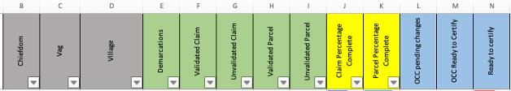
- **Contains the following columns**, with their source listed when relevant: 
    - **Chiefdom**
    - **Vag**
    - **Village**: each village has its own row, copy and pasted from the official list of villages
    - **Demarcations**: total number of demarcations per village, data is pulled from the demarcations sheet by matching village names
        ```
        =COUNTIF(demarcations!H:H,'Master Sheet'!D2)
        ```
        - Counts the number of times each village appears in the demarcation sheet (row H of the demarcations sheet contain village names, which the expression matches with the village column in the master sheet, row D)
    - **Validated Claim**: the goal is to have the number of validated claims to be equal to the number of demarcations, but not all parcels will have a claim
        ```
        =COUNTIF(validated_claims!W:W,'Master Sheet'!D2)
        ```
        - Counts the number of times each village appears in the validated_claims sheet, which pulls claims data from the public schema
    - **Unvalidated Claim**: lists the number of claims yet to be validated, the ones that remain on the update schema
        ```
        =COUNTIF(unvalidated_claims!X:X,'Master Sheet'!D2)
        ```
        - Counts the number of times each village appears in the unvalidated_claims sheet, which pulls claims data from the update schema
    - **Validated Parcel**: the goal is to have the number of validated parcels equal to the number of demarcations
        ```
        =COUNTIF(validated_parcels!J:J,'Master Sheet'!D2)
        ```
        - Counts the number of times each village appears in the validated_parcels sheet, which pulls claims data from the public schema
    - **Unvalidated Parcel**: 
        ```
        =COUNTIF(unvalidated_parcels!K:K,'Master Sheet'!D2)
        ```
    - **Claim Percentage Complete**
    - **Parcel Percentage Complete**
    - **OCC Pending Changes**
        ```
        =COUNTIF('OCC Parcel Not Ready to Certify'!AK:AK,'Master Sheet'!D2)
        ```
        - Counts the number of times each village appears in the ‘OCC Parcel Not Ready to Certify’ sheet, pulls occ data from the update schema
    - **OCC Ready to Certify**:
        ```
        =COUNTIF('OCC Parcel Ready to Certify'!AJ:AJ,'Master Sheet'!D2)
        ```
        - Counts the number of times each village appears in the ‘OCC Parcel Ready to Certify’ sheet, pulls OCC data from the public schema
    - **Ready to Certify**: OCC ready to certify/demarcations, the amount of parcels ready for final approval 


### Error Spotter

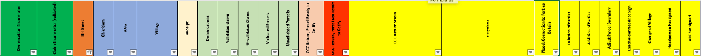
- Has a row for each parcel/demarcation, with the ability to filter by village and chiefdom to find records with missing information, and filter further by HH sheet or receipt to identify the parcel that needs to be validated/changed/etc. 
- This sheet is compiled by matching data from the other sheets (which pull data from the update and public schema on the server) and matching it to the receipt number (additional details on the source of each column is below).
- **Columns and their source**: 
    - **Demarcation Enumerator**: 
        ```
        =INDEX(demarcations!D:D,MATCH(error_spotter!H2,demarcations!P:P,0))
        ```
        - Pulls tech name from demarcation sheet by matching parcel id with the receipt number in error spotter (the receipt number corresponds to the parcel id)
    - **Claim Enumerator**: 
        ```
        =INDEX(validated_claims!A:A,MATCH(error_spotter!H7,validated_claims!E:E,0))
        ```
        - Pulls tech name from validated_claims sheet by matching parcel id with the receipt number in error spotter (the receipt number corresponds to the parcel id)
    - **HH Sheet**:
        ```
        =INDEX(demarcations!Y:Y,MATCH(error_spotter!H2,demarcations!P:P,0))
        ```
        - Pulls HH sheet data from the demarcations sheet by matching parcel id with the receipt number in error spotter (the receipt number corresponds with parcel id)
    - **Chiefdom**:
        ```
        =INDEX(demarcations!F:F,MATCH(error_spotter!H2,demarcations!P:P,0))
        ```
        - Pulls chiefdom data from the demarcations sheet by matching parcel id with the receipt number in error spotter (the receipt number corresponds to the parcel id)
    - **VAG**:
        ```
        =INDEX(demarcations!G:G,MATCH(error_spotter!H2,demarcations!P:P,0))
        ```
        - Pulls VAG from the demarcations sheet by matching parcel id with the receipt number in error spotter (the receipt number corresponds to the parcel id)
    - **Village**:
        ```
        =INDEX(demarcations!H:H,MATCH(error_spotter!H2,demarcations!P:P,0))
        ```
        - Pulls village data from demarcations sheet by matching parcel id with the receipt number in error spotter (the receipt number corresponds to the parcel id)
    - **Receipt**: aka the number part of the parcel id, used to match data from other sheets into the error_spotter sheet
    - **Demarcations**: checks if demarcation data exists
        ```
        =COUNTIF(demarcations!P:P,error_spotter!H2)
        ```
        - Counts whether the receipt/parcel id number appears in the demarcations sheet.
        - 0 if the receipt number does not have a demarcation, 1 if the receipt number does have a demarcation 
    - **Validated Claims**: checks if the parcel has a validated claim
        ```
        =COUNTIF(validated_claims!E:E,error_spotter!H2)
        ```
        - Counts whether the receipt/parcel id number appears in the validated claims sheet
        - 0 if the receipt number does not have a validated claim, 1 if the receipt number has a validated claim
    - **Unvalidated Claims**:
        ```
        =COUNTIF(unvalidated_claims!E:E,error_spotter!H2)
        ```
        - Counts whether the receipt/parcel id number appears in the unvalidated claims sheet
        - 0 if the parcel has a validated claim, 1 if the parcel has yet to be unvalidated (should be the opposite of the value in validated claims)
    - **Validated Parcels**:
        ```
        =COUNTIF(validated_parcels!B:B,error_spotter!H2)
        ```
        - Count whether the receipt/parcel id number appears in the validated parcels sheet
        - 0 if the parcel is unvalidated, 1 if the parcel is validated
    - **Unvalidated Parcels**:
        ```
        =COUNTIF(unvalidated_parcels!B:B,error_spotter!H2)
        ```
        - Count whether the receipt/parcel id number appears in the unvalidated parcels sheet
        - 0 if the parcel is validated, 1 if the parcel is unvalidated (should be the opposite of the value in validated parcels)
    - **OCC Return, Parcel Ready to Certify**:
        ```
        =COUNTIF('OCC Parcel Ready to Certify'!D:D,error_spotter!H2)
        ```
        - Counts whether the receipt/parcel id number appears in the OCC Ready to Certify sheet
        - 0 if the parcel is not ready to certify, 1 if the parcel is ready to certify
    - **OCC Return, Parcel Not Ready to Ceritfy**: 
        ```
        =COUNTIF('OCC Parcel Not Ready to Certify'!D:D,error_spotter!H2)
        ```
        - Counts whether the receipt/parcel id number appears in the OCC Not Ready to Certify sheet
        - 0 if the parcel is ready to certify, 1 if the parcel is not ready to certify (should be the opposite of the value in ‘OCC Return, Parcel Ready to Certify)
    - **OCC Return Status**:
        ```
        =INDEX('OCC Parcel Not Ready to Certify'!G:G,MATCH(error_spotter!H2,'OCC Parcel Not Ready to Certify'!D:D,0))
        ```
        - Pulls the certified field in ‘OCC Parcel Not Ready to Certify’ sheet by matching the parcel id to the receipt number (in error spotter)
    - **Needs Correction to Parties Details**:
        ```
        =INDEX('OCC Parcel Not Ready to Certify'!H:H,MATCH(error_spotter!H2,'OCC Parcel Not Ready to Certify'!D:D,0))
        ```
        - Pulls data from the cor_condition (correction) field in the ‘OCC Parcel Not Ready to Certify’ sheet
        - Value is ‘yes’ if the parcel needs corrections
    - **Deletion of Parties**: 
        ```
        =INDEX('OCC Parcel Not Ready to Certify'!I:I,MATCH(error_spotter!H2,'OCC Parcel Not Ready to Certify'!D:D,0))
        ```
        - Pulls data from the del_condition (deletion of parties) field in the ‘OCC Parcel Not Ready to Certify’ sheet
        - Value is ‘yes’ if the parties need to be deleted
    - **Addition of Parties**:
        ```
        =INDEX('OCC Parcel Not Ready to Certify'!J:J,MATCH(error_spotter!H2,'OCC Parcel Not Ready to Certify'!D:D,0))
        ```
        - Pulls data from the add_condition (addition of parties) field in the ‘OCC Parcel Not Ready to Certify’ sheet
        - Value is 'yes' if parties need to be added
    - **Adjust Parcel Boundary**:
        ```
        =INDEX('OCC Parcel Not Ready to Certify'!K:K,MATCH(error_spotter!H2,'OCC Parcel Not Ready to Certify'!D:D,0))
        ```
        - Pulls data from the bound_condition (adjust parcel boundary) field in the ‘OCC Parcel Not Ready to Certify’ sheet
        - Value is 'yes' if the parcel boundary needs to be changed
    - **Landholder Needs to Sign**:
        ```
        =INDEX('OCC Parcel Not Ready to Certify'!L:L,MATCH(error_spotter!H2,'OCC Parcel Not Ready to Certify'!D:D,0))
        ```
        - Pulls data from the sig_condition (signature) field in the ‘OCC Parcel Not Ready to Certify’ sheet
        - Value is ‘yes’ if the landholder still needs to sign
    - **Change of Village**:
        ```
        =INDEX('OCC Parcel Not Ready to Certify'!M:M,MATCH(error_spotter!H2,'OCC Parcel Not Ready to Certify'!D:D,0))
        ```
        - Pulls data from the vil_condition (village condition) field in the ‘OCC Parcel Not Ready to Certify’ sheet
        - Value is ‘yes’ the village for the parcel needs to be changed
    - **Headperson has signed**:
        ```
        =INDEX('OCC Parcel Not Ready to Certify'!P:P,MATCH(error_spotter!H2,'OCC Parcel Not Ready to Certify'!D:D,0))
        ```
        - Pulls data from the headperson_signed field in the ‘OCC Parcel Not Ready to Certify’ sheet
        - Value is ‘yes’ if the headperson has signed, ‘no’ means the headperson still needs to sign
    - **VLC has signed**
        ```
        =INDEX('OCC Parcel Not Ready to Certify'!Q:Q,MATCH(error_spotter!H2,'OCC Parcel Not Ready to Certify'!D:D,0))
        ```
        - Pulls data from the vlc_signed field in the ‘OCC Parcel Not Ready to Certify’ sheet
        - Value is 'yes' if the VLC has signed, 'no' if the VLC still needs to sign
- Columns demarcation, validated claims, validated parcels, unvalidated parcels: value is 1 if the parcel falls within one of these categories 
    - If a parcel has a value of 1 for both validated and unvalidated, you can spot the error and then look at the parcel specific data to find the inconsistency 


## Example Uses
- Check the status of each village in the Master Sheet to see if claims or parcel validation isn't completed, and whether it is ready to certify.

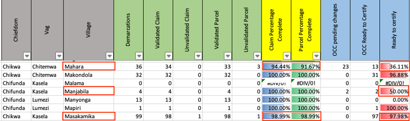

### Example 1
- In the image above, look at the row for the village ‘Mahara’. 94.4% of claims are complete, and 91.67% of parcels are complete. There are no unvalidated claims, which is okay, as sometimes not all demarcations will have a claim associated with them. But all parcels must be validated, and there are three remaining unvalidated parcels. For OCC, 36.11% of parcels are ready to certify. And there are 23 parcels that are pending changes. 
- First let's look at the error_spotter for the village ‘Mahara’:
    - Go to error_spotter and then click the filter icon on the village column.

    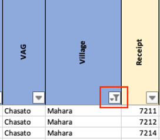
    - Then filter by ‘Equals’ and then type Mahara.

    
    - Now look at the column ‘Unvalidated Parcels’ and filter by descending, so that the rows with a value of 1 (meaning they are unvalidated) are at the top.

    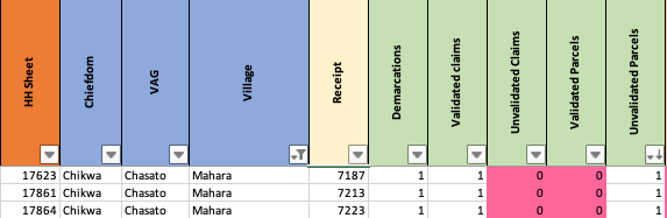
    - So far everything looks okay as the parcels don’t have a 1 for both validated and unvalidated values.
    - Now go to the unvalidated_parcels sheet so we can get some more information.
        - Filter by village again where village equals ‘Mahara’ (same as we did in the error_spotter sheet).
    
    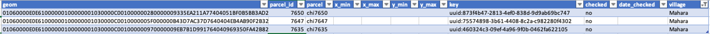
    - We can see that all of the parcels have geometry, so they don’t need to be digitized. But the checked column is set to ‘no’. Thus these parcels need to be checked in the monitoring_tool qgis project. 
- Now let's look at the OCC status of records for ‘Mahara’. As the master sheet told us, 36.11% of parcels are ready to certify. And there are 23 parcels that are pending changes.
- First we need to filter the error spotter to display the records with an ‘OCC Return Status’, which means that these parcels are in the OCC phase. Filter and select all the values except N/A.

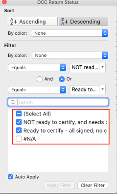
- Now we can see where some errors have occurred, that have led to some duplicate parcels/parcel IDs in the ‘OCC Parcel Not Ready to Certify’ sheet. We see this because the column ‘OCC Return, Parcel Not Ready to Certify’, for the first three rows, has a value of 2, when it should only have a value of 1 or 0. The ‘2’ means that the parcel ID has been counted twice. 

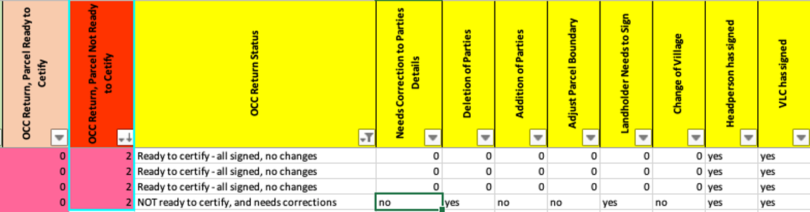
- Now we can go to the sheet ‘OCC Parcel Not Ready to Certify’ to try and look deeper into the error.

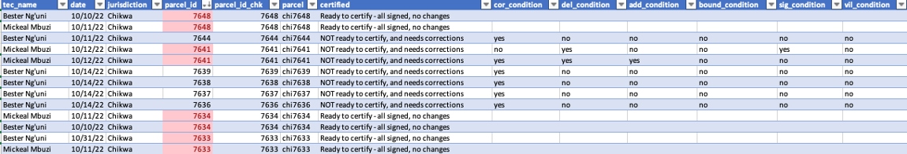
- It looks like some are exact duplicates, while others have different values for whether they need corrections. To remedy the error, one should look at the original HH sheets  and ODK submissions to see if they differ in any way. 
- Go back to the error_spotter, and look at the other records where the ‘OCC Return, Parcel No Ready to Certify’ is 1. You can then look at the other OCC Columns to see where corrections are needed, such as the deletion of parties, addition of parties.
- For example some of the records need the headperson and the VLC to sign. Others require corrections that are not specified, and the relevant OCC Register will need to be checked for the required changes.

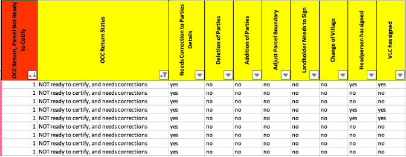
- Another issue is when ‘OCC Return, Parcel Ready to Certify’ and ‘OCC Return, Parcel Not Ready to Certify’ are both 1. This means that the record has been moved to the public schema without the record then being removed from the update schema. Rerunning the OCC SQL scripts should fix this problem, and then refresh the data connection in the excel sheet.

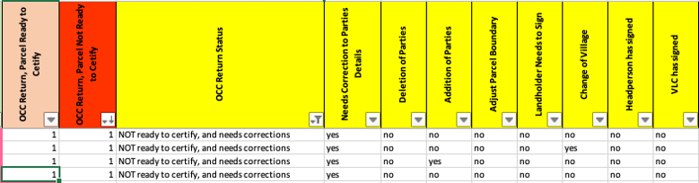

### Example 2


- In this example we will look at OCC for Manjabila, where there are two parcels that are pending changes.
- First go to error spotter and filter the village columns like we did in Example 1, but we want village to be ‘Manjabila’ this time. Then filter the ‘OCC Return Parcel Not Ready to Certify’ to descending. The first two rows are now the parcel information that needs to go through OCC.

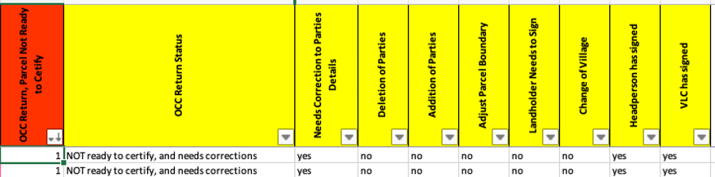
- There are not any specific changes noted, so the OCC register will need to be checked and the required changes made. Also consult the OCC tool in Access.

The next section covers how databases are updated through a set of scripts that pull new data from ODK Central on to the update schema, and how once data is validated, it is moved from the update to the public schema. 

**[Previous](Digitization_Validation.html) <> [Next](/Pages/Updating_Databases.html)**
