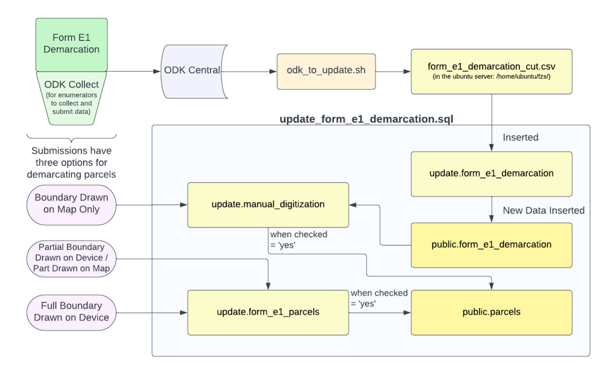

# Parcel Handling from ODK Collect to QGIS
## Overview

### Form E1-Demarcation
_Filled out by enumerators in the field through ODK Collect. This is the form that records all the geographic information about parcels_
- Several fields record geographic information:
    - Location of access to the parcel (required)
    - Demarcation point (required)
        - recorded within the boundary of the parcel
    - Parcel location: map sheet number and map poly number are used later for georeferencing
        - Image of the HH mapsheet (required)
            - the image should clearly show the new parcel boundary drawn on it and annotated with the parcel number
- The other geographic information depends on how the parcel boundary is being recorded:
    - Boundary drawn on map only
    - Partial boundary drawn on device / part drawn on map
        - Lat-Long point taken any time the enumerator changes direction, and at least once every ten meters
    - Full boundary area collected on device
        - Lat-Long point taken any time the enumerator changes direction, and at least once every ten meters
        - ODK collect form also allows the enumerator to close the polygon after they've collected all the points

### Automated Data Processing for Parcels and Demarcation Data
#### [odk_to_update.sh](../General_Assets/odk_to_update.sh):
- This is a bash script that automates API calls to ODK Central, unpacks CSV files and calls an SQL script to load the data onto the update schema. This shell script is run as a cron job twice per day.
    - removes some unnecessary fields and saves submission data as csv form_e1_demarcation_cut.csv in the ubuntu server: /home/ubuntu/fzs/

#### [update_form_e1_demarcation.sql](../General_Assets/updateSQLScripts/update_form_e1_demarcation.sql):
- Inserts form_e1_demarcation_cut.csv into _update.form_e1_demarcation_
- If the enumerator recorded a full boundary area, the parcels are drawn and inserted into _update.form_e1_parcel_
- Updates the public schema with new data (not geographic data) from form E1
    data from update.form_e1_demarcation is inserted into _public.form_e1_demarcation_
- Updates parcels in the public schema with geographic data from update.form_e1_parcels
    - inserts parcel data from _update.form_e1_parcels_ when these parcels have been checked (attribute ‘checked’ = ‘yes’), and inserts them into public.parcels (these are submissions with a partial or full boundary drawn that have been digitized and checked)
- manual_digitization table: data from _public.form_e1_demarcation_, these are submission with the boundary on a hand drawn map only
    - once these parcels are manually digitized and checked, they are inserted into public.parcels

After the parcels go through the automated data processing, they are [manually validated and georeferenced](Digitization_Validation.html) in QGIS.

**[Previous](Data_Processing.html)** <> **[Next](MonitoringTools.html)**
