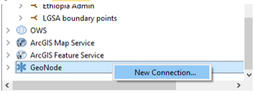

# Geonode

Geonode is a data management solution for hosting and serving map data. The Geonode for ILRG was created by Leland Smith and has a dozen or so files from a folder of base shapefiles that ILRG had already compiled. The Geonode also contains cleaned datasets of points of interest, villages, roads, streams, chiefdoms, hunting locations, community forests, game management areas, national parks, forest reserves, and more. 

### Functions 
- Explore data
- Explore interactive maps
- Upload layers or documents
- Create maps
- Download and use data directly in QGIS

### [Tutorial Video](https://youtu.be/IkgNbam9KEM)

### Upload Data from QGIS
- Right click on Geonode in the browser on the left side and add a new connection.

- Name it and put in the url http://52.2.213.217/ in, like below and click OK (You can ignore the rest of the settings).

- Open your new GeoNode folder there and you should see a list of all the layers published, which you can add to your map like any other layer. Note: layers are in two categories – WMS and WFS – which have different functions. A WFS will appear as a vector layer and can be styled and edited in QGIS as needed. A WMS is mostly just an image layer, so it can’t be styled here. We’re working on improving some of the basic styles on our end.

Geonode documentation by [Leland Smith](https://github.com/llsmith05).
