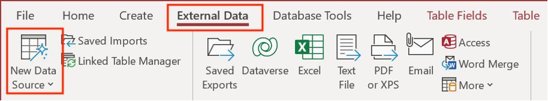
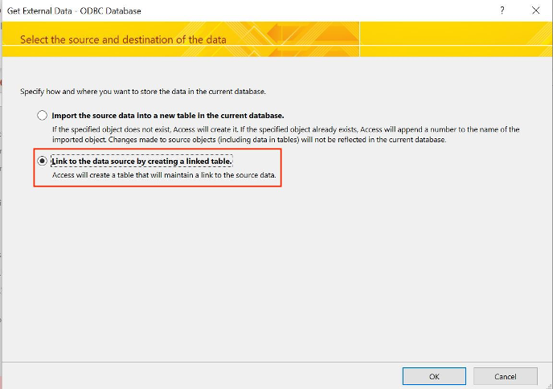
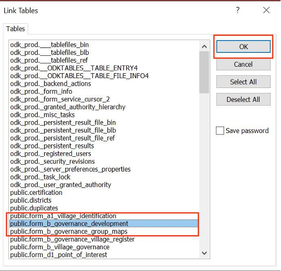
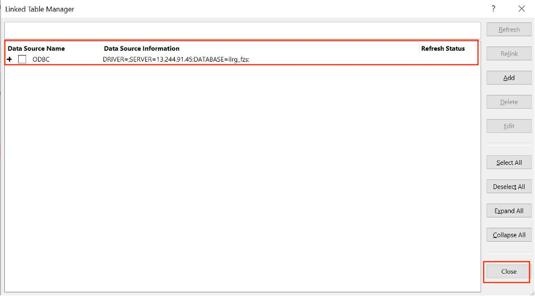
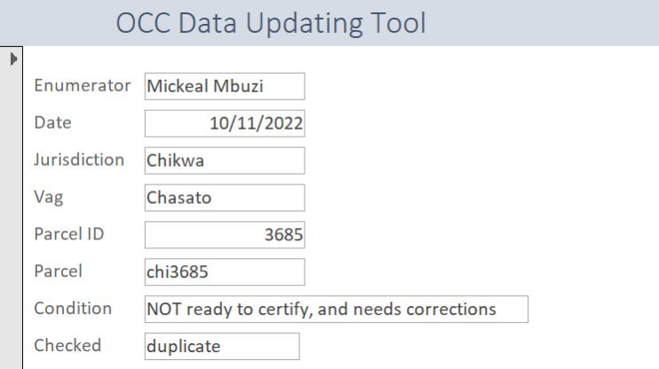
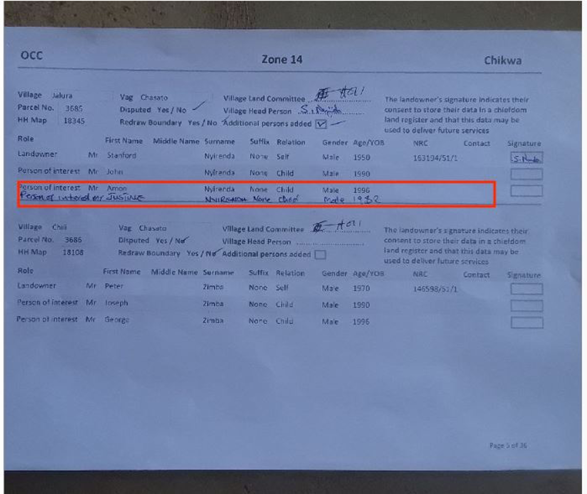
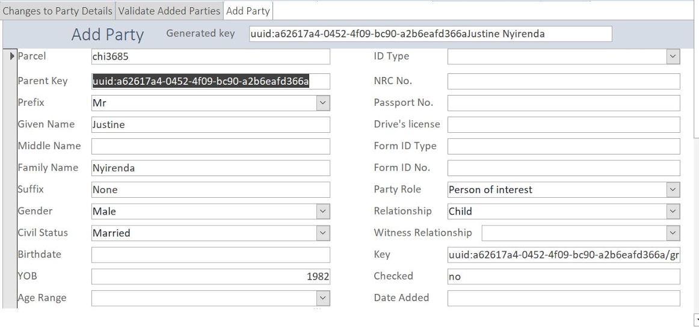
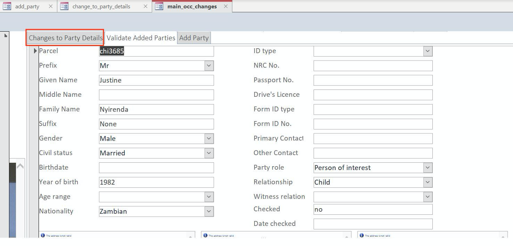
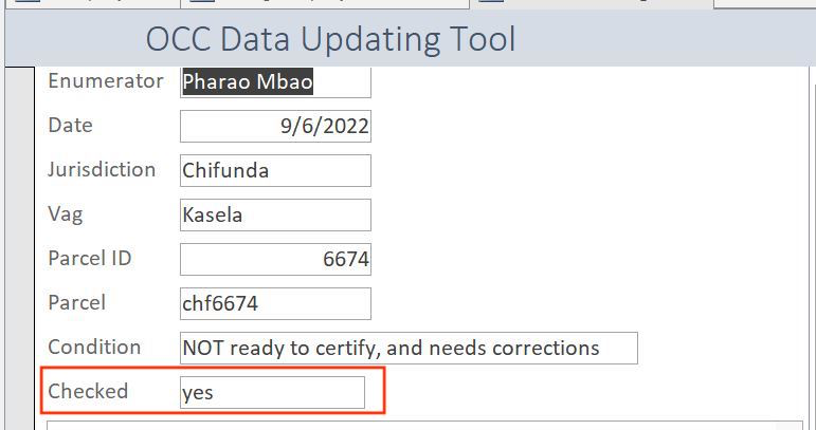

# OCC Update GUI (Graphical User Interface)
_Required corrections as part of the OCC process are conducted in Access through a GUI connected with the server. The GUI pulls OCC data and images of the OCC Form from the server, and allows the user to make changes to records directly._

## Set up and Connect OCC Updates Tool
- Open OCC_updates.accdb in Access (contact supervisor or database administrator to get the access file).
- Go to External Data > New Data Source > From Other Sources > ODBC Database.

- In the 'Get External Data' pop up, select ‘Link to the data source by creating a linked table’, then click OK.

- In the ‘Select Data Source’ pop up, choose ‘Machine Data Source’, then click ‘PostgreSQL30’.
    - Then click 'OK'.
    - You can choose any random table from the list, then click 'OK'.

- Then go to 'External Data', and click on ‘Linked Table Manager’.
    - In the pop-up, select the **second** ODBC data source, and then click ‘Edit’.
- Then highlight and copy the ‘Connection String’, then edit the first source and past in the new connection string.
    - You want to replace the connection string that starts with ‘DSN=ilrg_fzs’ with the one that starts with ‘DSN=PostgreSQL30’.
    - Hit 'Save' and 'Close'.
    - You should see only one data source now.

- Now you can view all of the tables and forms.

## Objection, Correction and Confirmation 
- Click on main_occ_changes under forms.
- Log into the image server, ask the database administrator for credentials.
- Look at the data under 'OCC Data Updating Tool’ and look at ‘Condition’, this tells you whether the record needs corrections.

- In this example, the condition reads ‘NOT ready to certify, and needs corrections’.
- Scroll down to view the image of the OCC Form.
    - In the picture of the OCC Form, we see that a person needs to be added.

- Scroll to the right for the corrections options, you can change party details, validate added parties, or add party.
    - For this example, we would need to add party by copying the information from the OCC form picture into the access GUI in the ‘Add Party’ tab.

- Then you need to validate the added party in the 'Validate Added Parties' tab.

- If the party details need to be changed, make those changes in the 'Changes to Party Details' tab.

- Once you've done the corrections and checked work, set the ‘Checked’ field, under OCC Data Updating Tool to ‘yes’. This allows the SQL script to move the data onto the public schema. 

**[Previous](OCC.html) <> [Next](Parcel_Cleanup.html)**
