## OCC Parcel Cleanup and Corrections

In the OCC process, as part of the village register, draft certificates are created for each parcel, which also lists every party involved in that parcel. Changes are noted directly on printed versions of these certificates, and then information on the party and parcel boundaries is edited accordingly.

### Set up Parcel Cleanup QGIS Project
Load the following layers:
- form_e1_demarcation
- form_e2_claims_parties
- parcels
- Google Satellite

### Set Up Certificate
- Go to 'Project' > 'New Print Layout'

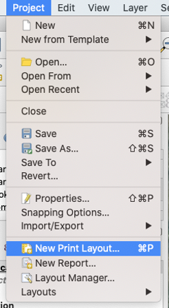
- Name the layout
- Set the page properties by right clicking on the empty panel, set the size to 'A4' and the Orientation to 'Portrait'

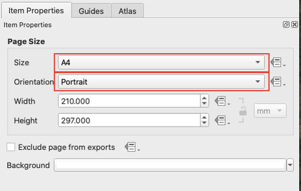

### Configure Atlas
- Under the 'Atlas' tab on the right side panel, click the checkbox next to 'Generate an atlas'
- Set the following under 'Configuration'
    - Coverage layer: parcels
    - Page name: dem_parcel
    - Sort by: dem_parcel

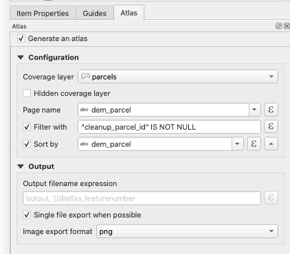

### Add Relation to Project
- This relation will be used later to configure the attribute tables in the certificates
- Go to 'Project' > 'Project Properties' and then click on the 'Relations' tab. Then click on 'Add Relation'


- Configure the relation as follows:
    - Name: parties_join
    - Relationship strength: Association
    - Layer and fields mapping:
        - Referenced (parent)
            - Layer: certification
            - Field 1: parcel
        - Referencing (child)
            - Layer: form_e2_claims_parties
            - Field 1: parcel_parties


### Heading
- Use the 'Add Label' tool for the top line of the heading with the text:

' Chiefdom Village Parcel ID Parcel '
- Use the 'Add Label' tool for the bottom line of the heading with the following expression: ```[% "dem_jurisdiction" %] [% "dem_village" %] [% "id_parcel" %] [% "dem_parcel" %]```
    - example output: Chifunda Kalapazuba 101 CHF101

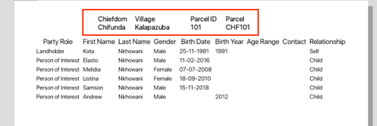

### Table
- Use the 'Add Attribute Table' tool and set the 'Main Properties' to:
    - Source: Relation Children
    - Relation: parties
- Set the 'Appearance' in the same panel:
    - Cell margins: 1.0 mm
    - Display header: On First Frame
    - Empty Tables: Show Set Message
- Then click on 'Attributes...'

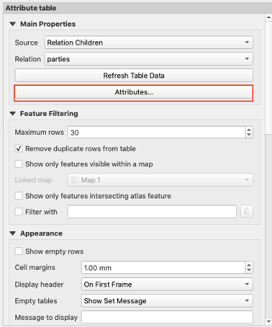
- Fill out the attribute table that pops up according to the image below:
    - expression for Birth Date: ```format_date( "birthdate",'dd-MM-yyyy')```
    - expression for Birth Year: ```to_string( if("birthyear" = '', '', "birthyear" )) ```

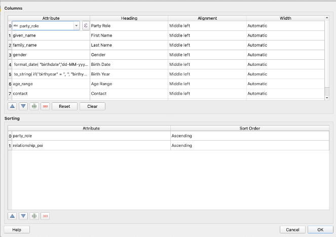

### Parcel Map
- Use the ‘Add Map’ tool, select and drag the box so that the map takes up the bottom half of the page
- Make sure the parcels are labelled in the main window of QGIS using Layer Properties
- Under ‘Item Properties’ > ‘Controlled by Atlas’ should be checked, set the Margin around feature to 10%

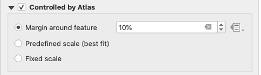
- Under 'Item Properties' > 'Grid', add new grid by clicking on the green plus sign, or select an existing grid and click 'Modify Grid...'

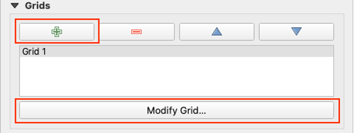
- A new panel should pop up. Set the grid appearance to the following:

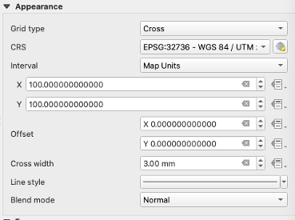
- Scroll to the bottom of 'Map Grid Properties' and click the check box next to 'Draw Coordinates'. Then set the fields according to the following:

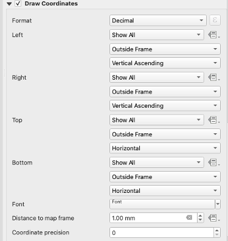
- The map should look something like this:

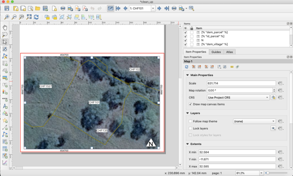
- The complete certificate should look something like this:

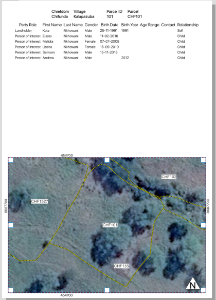
