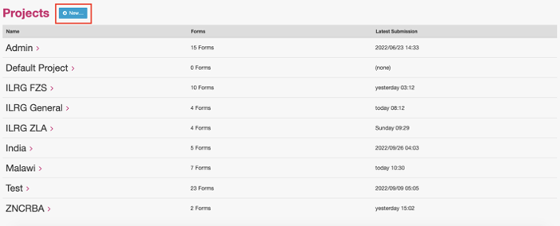
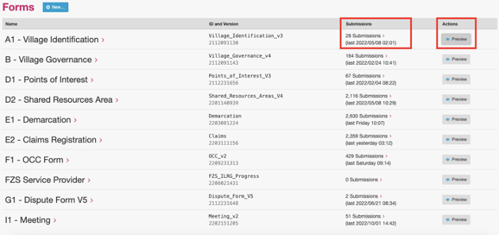
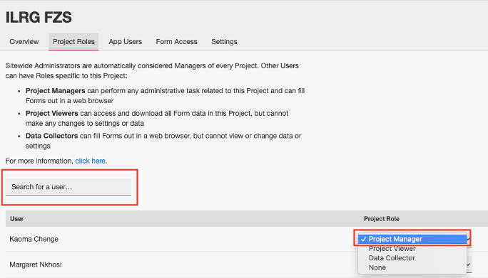
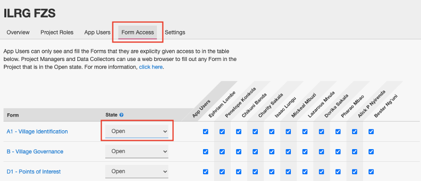
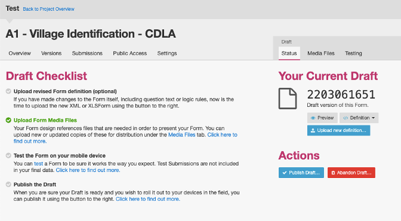
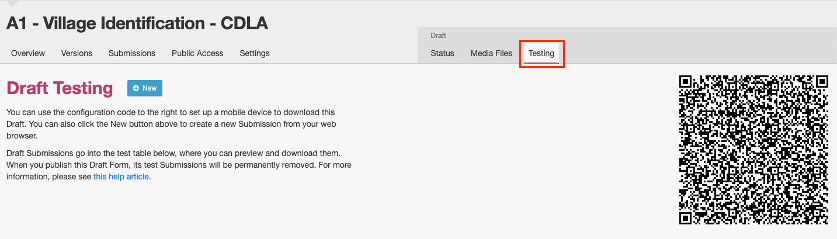

# Navigating and Using ODK Central
From Managing Projects to Form Creation

## Managing Projects in ODK Central
Projects organize forms and users into different groups. Forms must be created in a project folder.

#### **Users**
- Administrators can manage any project, users created on the Central Server can also be designated as project managers or data collectors
- App users are created inside each project, and can use a mobile device to collect submission data, app users can be assigned access to specific forms (see further instructions below on how to configure users on ODK Collect)

#### **Create a Project**
- Only designated administrators on ODK Central can create projects, you can create a new project by clicking on the new button to the right of the projects header
    - Administrators must be designated as such in the command line of the server

#### **Project Overview**
- You can click on a project to view the forms that are part of the project, the submission details, and you can also preview forms
- Click on each form to view more information

#### **Project Roles**
- To add a user to a project, type their username or email in the search bar, your search result will then appear in the table below, and you can use the drop down menu to choose the appropriate role for that user (you must be an administrator on ODK Central to add users to projects)
- For example, in the picture below, Kaoma is set as a project manager

## Manage Forms in ODK Central
#### **Control Form Access**
- You can control who has access to forms under the form access tab under the project title
- This interface also allows you to change the state of the form to open, closing or closed

#### **Upload Form to ODK**
- Navigate to the project folder where you want to add a form
- Then click the new button and choose the form to upload, the ILRG project uses XLSForms in excel, choose the relevant xlsx form and then hit create (more on how to create an XLSForm below)
    - You can also drag and drop your file into the gray box
- If you get any errors, try changing the name of the file or the file_id attribute in the settings sheet (this could mean an old form had the same name or id, or if you’re updating a form that already exists, you should change both of these attributes)

### Form Drafts
ILRG uses form drafts to test out new versions of forms.
- Drafts are accessible only to privileged Project staff. Each Form Draft has a unique access token which allows data collection users to submit test submissions to the Draft. These test submissions disappear automatically when the Draft is published
- Every form that is uploaded starts as a draft, the draft status page gives you control over the draft
    - You can upload a new form definition (this will replace the current draft version), publish a draft, or delete a draft

- The testing tab gives you a QR code that mobile devices can use to submit draft submissions, the draft submissions will then appear in the table below

The next section covers how to create and configure the XLSForms that ODK Central uses to read and display the data collection forms. 

**[Previous](Adding_Users.html) <> [Next](XLSForms.html)**