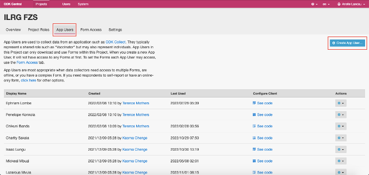
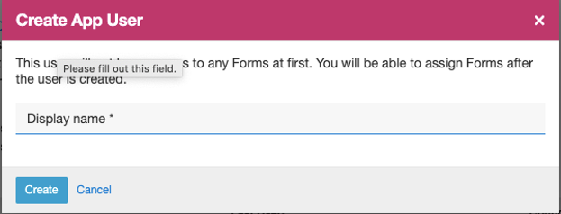
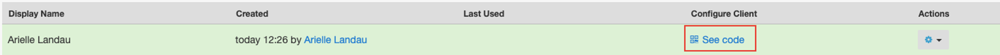
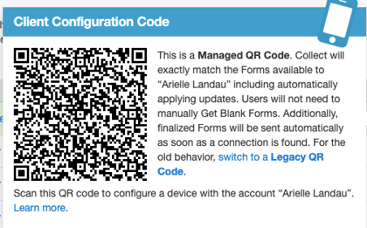
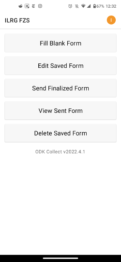
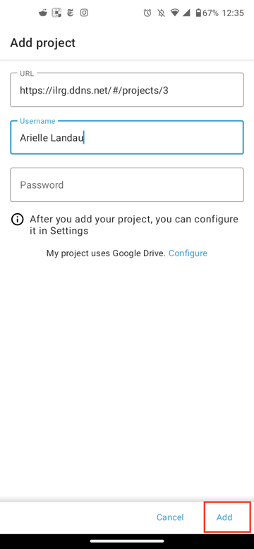
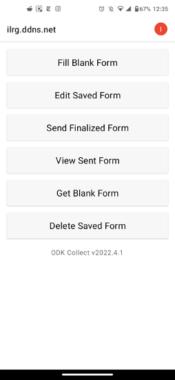

# Setting Up and Configuring ODK Collect
ODK Collect is an open source android app that the ILRG project uses to collect submissions to forms made and uploaded onto ODK Central.

### Configuring Collect in Central
- The first step to set up ODK Collect must be done by a project manager in ODK Central
    - for each project folder that you wish to give people access to, go to the 'App Users' tab and click on 'Create App User...' in the top right corner

- assign a display name for each data collector on the project

- this will generate a unique QR code for each app user (data collector) that will allow them to configure ODK Collect and thereby receive access to all the relevant forms
- To see each user's QR code, click on 'See code'

- You should see something like the following pop up:

### Configuring ODK Collect Application
- Download ODK Collect from the Google Play Store
- Configuring ODK Collect:
    - When you first launch collect, choose to Configure with QR Code
    - Each app user should have a unique QR code, created in the last step, the project manager should show or send each app user their corresponding QR code
    - Scan the QR code, ODK Collect should then apply settings from the code and move you to the main menu of the application

- **You can also configure ODK Collect manually:**
    - When you first launch collect, choose 'Manually enter project details'
    - Enter the URL (and username/password if required) for your server
        - ex: for ilrg_fzs, the url is: [https://ilrg.ddns.net/#/projects/3](https://ilrg.ddns.net/#/projects/3)
    - Click add

The next documentation section covers data processing and handling. It goes over how all images and parcels are handled in the system from data collection to validation as well as how data is monitored. 

**[Previous](XLSForms.html) <> [Next](/Pages/Data_Handling/Data_Processing.html)**