# Party Validation

_Party validation is conducted through a GUI (Graphical User Interface) configured in Microsoft Access. The GUI pulls party data from the update schema along with images of the corresponding demarcation receipt so the party details can be validated against the receipt._

## Set Up and Connect Party Validation Tool

_Since the party validation tool pulls data from the server, we need to configure and connect access to the ILRG server._ 

- First, [download Access](https://www.microsoft.com/en-us/microsoft-365/access), make sure it is the 32 bit version
- Once Access is downloaded, you need to set up an ODBC driver on your computer, [download the one for postgreSQL](https://www.postgresql.org/ftp/odbc/versions/)
- On the download page, click on the 'msi' folder, then scroll down and download psqlodbc_12_00_0000.zip

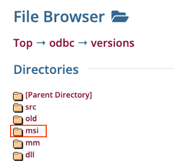
- Open Party_Validation_tool.accdb in Access (contact Database Administrator or Supervisor for the file)
- You won't see any data appear, and if you click on any of the layers, you will see an ODBC failure to connect error. We will set up that connection now. 
- Go to External Data > New Data Source > From Other Sources > ODBC Database

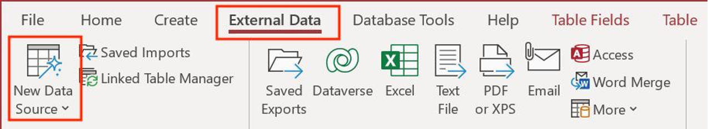
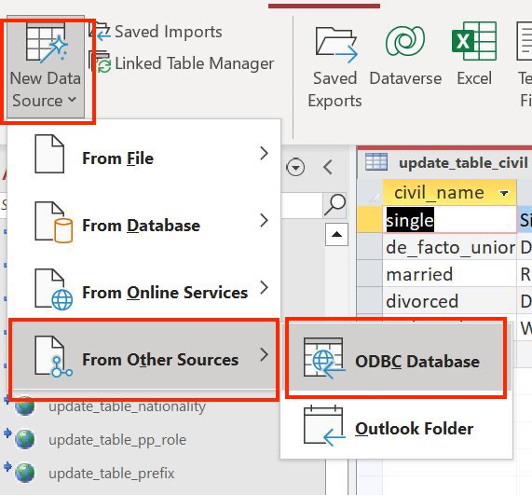
- In the 'Get External Data' pop up, select 'Link to the data source by creating a linked table’, then hit OK

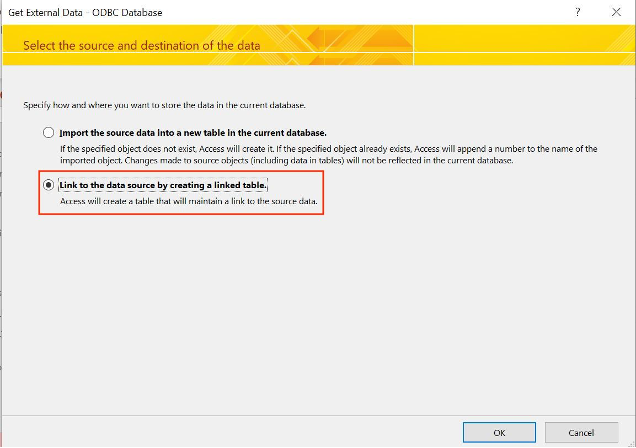
- In the ‘Select Data Source’ pop up, choose ‘Machine Data Source’, and then click ‘New’

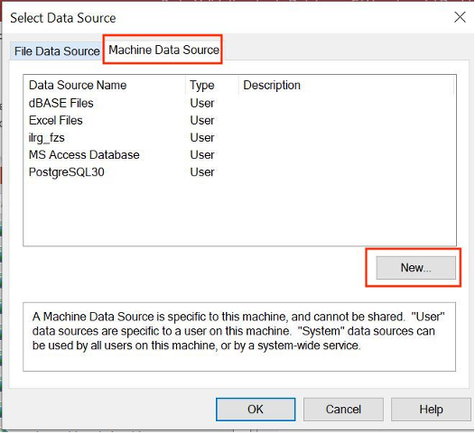
- Choose 'User Data Source' then click 'Next'

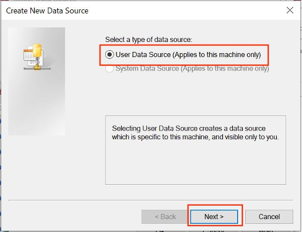
- Scroll down to the bottonm of the list of drivers, and choose 'PostgreSQL ANSI’, then click ‘Next, then click ‘Finish’

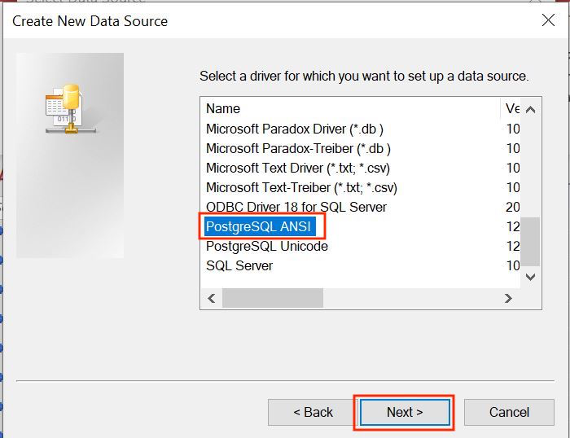
- Enter the following in the set up window (replace with your system's information when relevant): 
    - Data Source: PostgreSQL30 (leave as default)
    - Database: ilrg_fzs
    - Server: 13.244.91.45
    - User Name: your username
    - Password: your password
    - Description: you can leave this blank
    - SSL Mode: disable
    - Port: 5432
- Then test the connection, you should see a message ‘Connection successful’, then hit ‘Save’

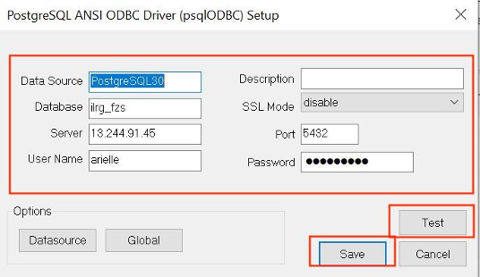
- Now we need to extract the connection string through a blank access database  
- Open a blank Access
- After opening the blank Access, go to External Data > New Data Source > From Other Sources > From ODBC Database
    - Then select 'Link to the the data source by creating a linked table’
    - Then choose ‘Machine Data Source’, and the source we just created: ‘PostgreSQL 30’, then hit ‘OK’
    - You can choose any random table from the list, then hit ‘OK’

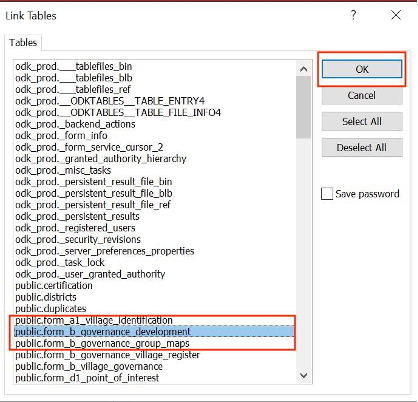
- Then go to ‘External Data’, and click on ‘Linked Table Manager’
    - In the pop-up, select the ODBC data source, and then click ‘Edit’

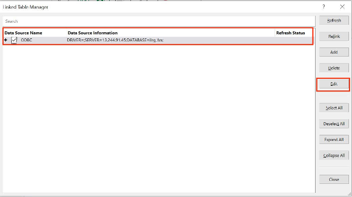
    - Then highlight and copy the ‘Connection String’, then close out the blank access and reopen the Party Validation Tool Access

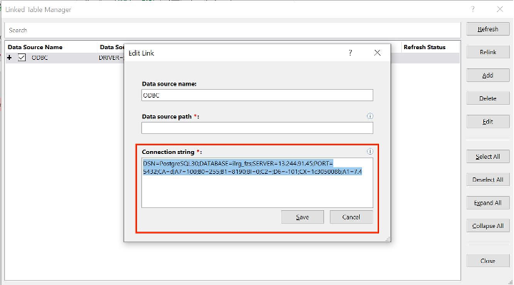
- Go back to the Party Validation tool access, go to ‘External Data’ > ‘Linked Table Manager’ 
    - Then highlight the ODBC data source, click Edit, and then Paste the connection string you copied into the connection string field, then hit ‘Save’

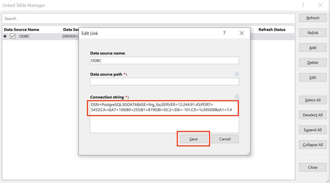
- Now you should be able to view all of the tables and forms

### Party Validation Access Objects
- You should see the following tables: 
    - update_form_e2_claims
    - update_form_e2_claims_parties
    - update_table_age_range
    - update_table_civil
    - update_table_civil_status
    - update_table_documents
    - update_table_documents_dem
    - update_table_nationality
    - update_table_pp_role
    - update_table_prefix
    - update_table_relationship
    - update_table_witness_relation
    - update_table_witness_type
- You should see the following queries:
    - Claims_party_validation
    - gender
- You should see the following forms:
    - Added Parties
    - claims
    - claims_party
    - Party Validation 

## Add Tables
- To add a table, follow the same process we used before to establish an ODBC connection
- Go to External Data > New Data Source > From Other Sources > ODBC Database, then choose ‘Link to the data source by creating a linked table’
    - Then choose ‘Machine Data Source’ and PostgreSQL30, then hit OK, and then choose the table you want to add from the list, then hit ok
- For example, I am going to select update.table_institutions, and then hit ‘OK’, and it will appear under ‘Tables’ on the left side panel 

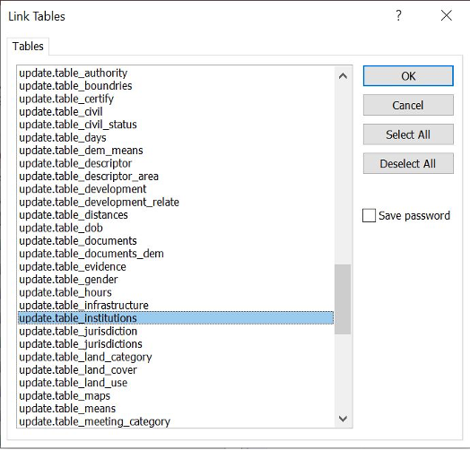
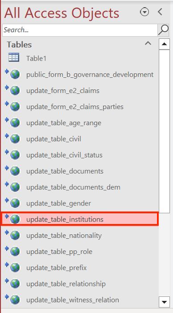

## Party Validation 
- Double click on 'claims' under the ‘Forms’ tab. You might be asked to log into the image server in order to view the images, contact the database administrator for credentials. 

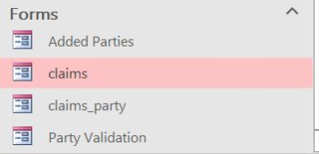
- The 'claims' form is used to validate all the parties submitted through ODK forms by comparing them to the photo of the demarcation slip
- Go through each field listed under ‘Party Validation’ and compare it to the photo of the demarcation slip, if everything looks good

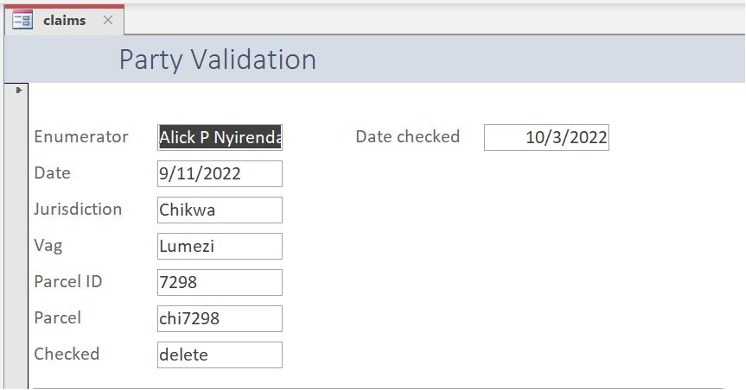
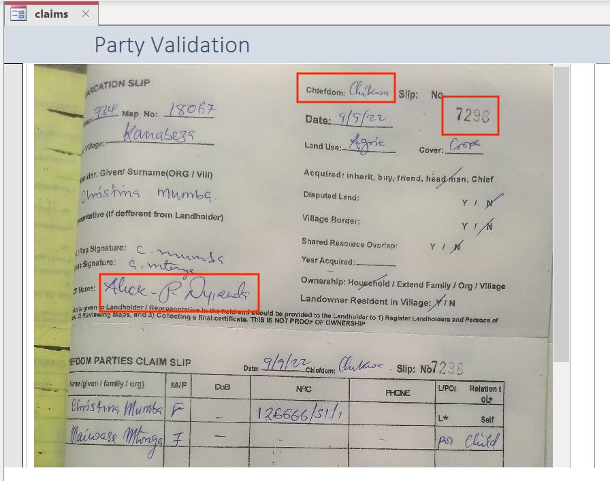
- Scroll down to view the 'Chiefdom Parties Claim Slip’ 

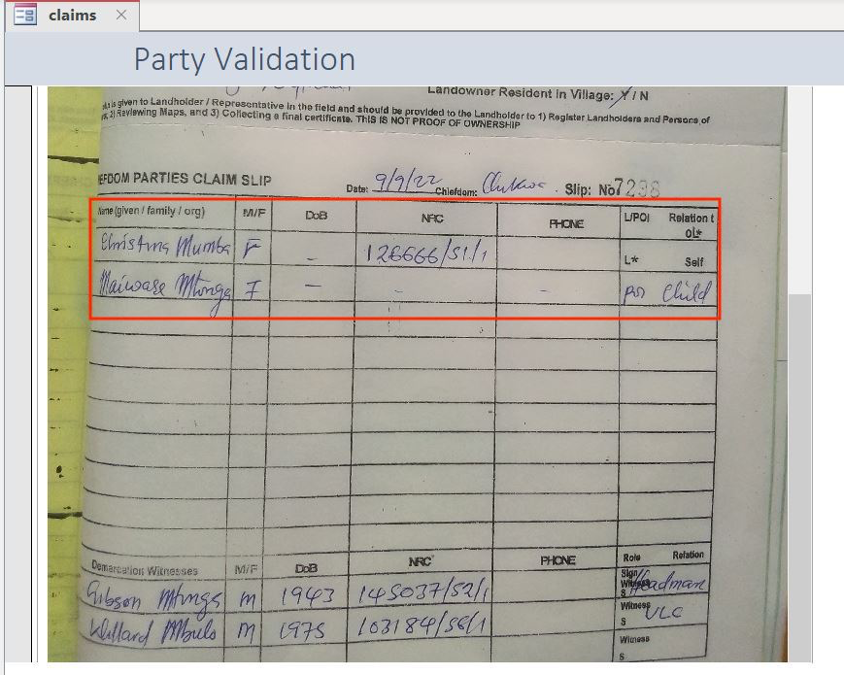
- Start with the fields in the 'Unvalidated' tab. Copy the information from the first row of the claim slip here. 

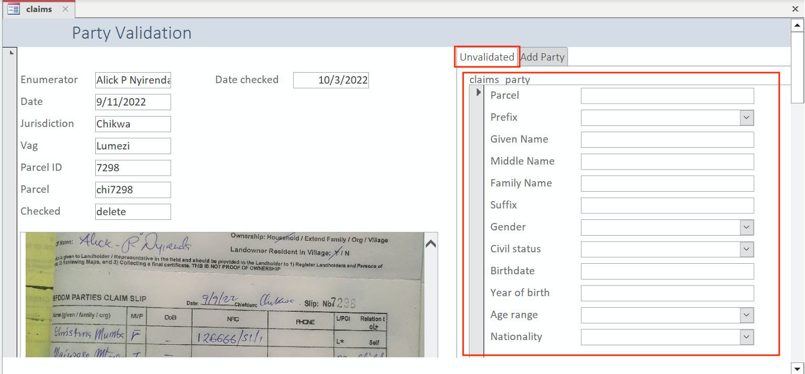
- If there are additional parties, go to the ‘Add Party’ tab, and copy information in the second row, and do the same for the third row, etc. 

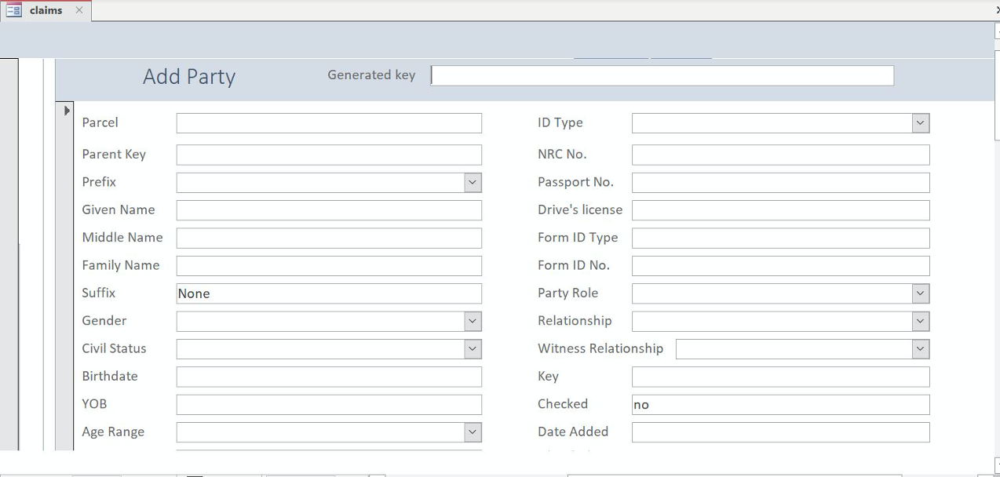
- After double checking everything set the ‘Checked’ field under ‘Party Validation’ to ‘yes’. This allows the update SQL scripts that run automatically to move the party information from the update to the public schema because it has been validated 

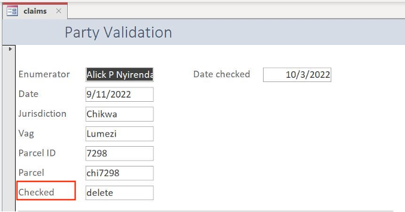
- Then click on the arrow on the bottom of the screen to move onto the next party 

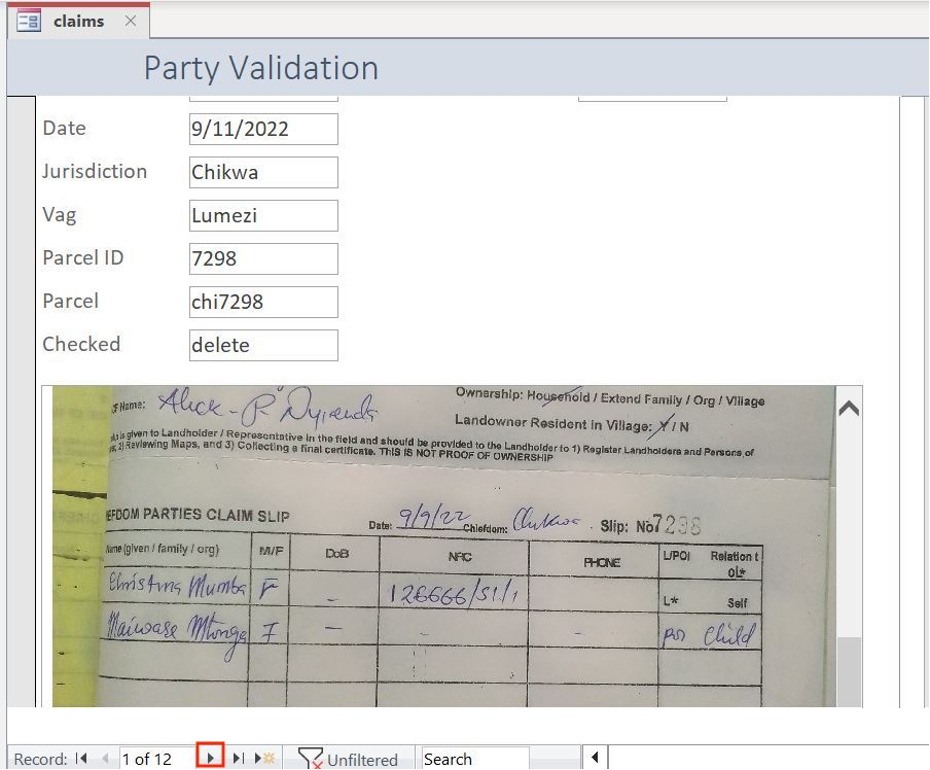

**[Previous](Updating_Databases.html) <> [Next](/Pages/OCC/OCC.html)**