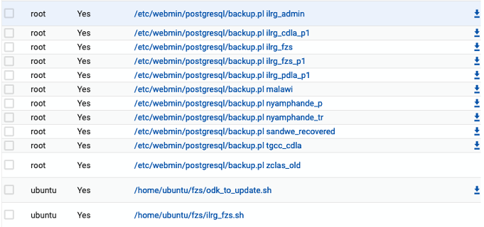
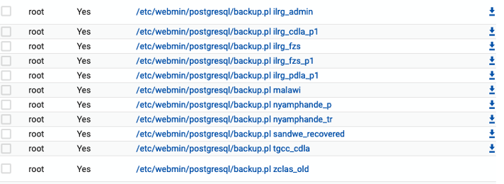
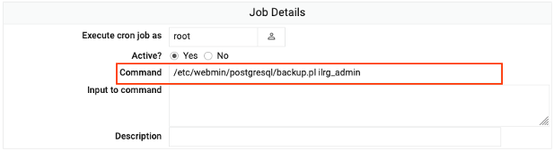
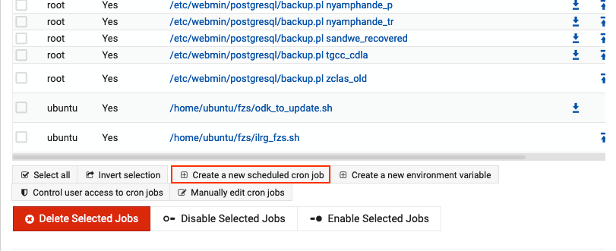
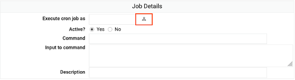
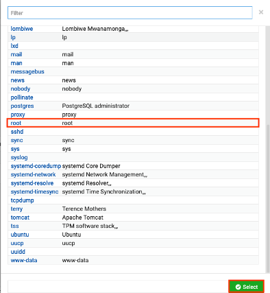
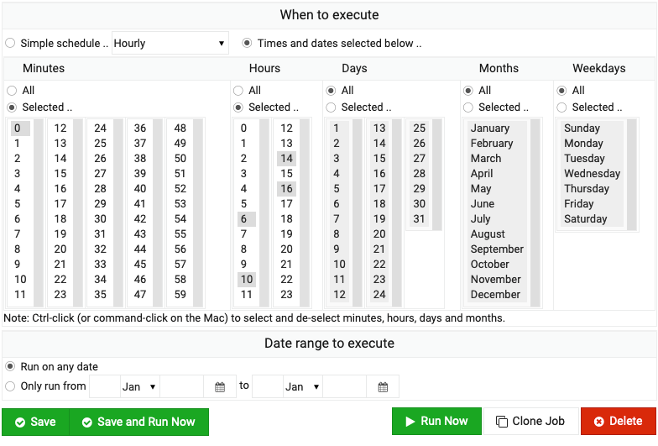

# Navigating the Webmin Interface

[Instructions for Setting up Webmin](Server/Webmin_Setup.html)

## Cron Jobs
Located under 'System' > 'Scheduled Cron Jobs'.
- Cron jobs are scheduled tasks. They execute shell scripts or commands in the background at specific times determined by the user.
- The ILRG project uses cron jobs to update the postgres server with new data from ODK Central, as well as to create backups of all the servers.
- The cron jobs are set to run at different times in order to avoid overloading the server.
- For example, pictured below is a cron job that is set to run every day at 1:30.


- keep in mind that there is no auto retry button for cron jobs, so if they fail, you will need to manually retry it.

#### **Cron Jobs Automatically Built In**


- When you install Webmin on the server, it comes with the cron jobs pictured above.

#### **Manually Added Cron Jobs**
- These include back up scripts for all of the PostgreSQL databases as well as shell scripts to run all of the update form sqls and the scripts that pull new data from ODK 
    - Details on these scripts are enumerated upon in the [Updating Databases](/Pages/Updating_Databases.html) section.


- [/home/ubuntu/fzs/odk_to_update.sh](/Pages/General_Assets/odk_to_update.sh)
    - The most up to date version is located in the home/ubuntu/fzs folder – access via Webmin’s file manager.
    - bash script that automates API calls to ODK Central, unpacks CSV files and calls an SQL script to load the data, this shell script is run as a cron job twice per day.
        - The script must be updated to include the correct project and form ids. Where the API calls ODK Central, the API endpoint should follow the following format:
        ```
        https://ilrg.ddns.net/v1/projects/[project_ID]/forms/[XML_form_ID]/submissions.csv.zip?attachments=false
        ```
            - For Example: 
            ```
            https://ilrg.ddns.net/v1/projects/3/forms/Village_Governance_v4/submissions.csv.zip?attachments=false
            ```
        - The API calls for forms with images in them will look slightly different, as the `attachments=false` statement is no longer true.
        ```
        https://ilrg.ddns.net/v1/projects/[project_ID]/forms/[XML_form_ID]/submissions.csv.zip?
        ```
            - For Example:
            ```
            https://ilrg.ddns.net/v1/projects/3/forms/Claims/submissions.csv.zip?
            ```
        - _you can find the project ID and XML form ID by going to ODK Central, opening the form and looking at the URL in the address bar, it will look similar to the URL above._
- [/home/ubuntu/fzs/ilrg_fzs.sh](/Pages/General_Assets/ilrg_fzs.sh)
    - Connects to the ilrg_fzs database and runs all of the update scripts, then commits those changes to the ilrg_fzs database.
    - Run as a cron job 5 times per day.
- Backup scripts exist for all of the postgres databases (most are from past ILRG projects): ilrg_admin, ilrg_cdla_p1, ilrg_fzs, ilrg_fzs_p1, ilrg_pdla_p1, malawi, nyamphande_p, nyamphande_tr, sandwe_recovered, tgcc_cdla, zclas_old.


- The backup scripts use the code in backup.pl:
    ```
    #!/usr/bin/perl
    open(CONF, "</etc/webmin/miniserv.conf") || die "Failed to open /etc/webmin/miniserv.conf : $!";
    while(<CONF>) {
            $root = $1 if (/^root=(.*)/);
            }
    close(CONF);
    $root || die "No root= line found in /etc/webmin/miniserv.conf";
    $ENV{'PERLLIB'} = "$root";
    $ENV{'WEBMIN_CONFIG'} = "/etc/webmin";
    $ENV{'WEBMIN_VAR'} = "/var/webmin";
    delete($ENV{'MINISERV_CONFIG'});
    chdir("$root/postgresql");
    exec("$root/postgresql/backup.pl", @ARGV) || die "Failed to run $root/postgresql/backup.pl : $!";
    ```
    - The backup scripts are loaded as a separate cron job for each postgres database by linking to the command followed by the database name.

    

### Add New Cron Job
- Scroll down on the cron jobs page and select ‘Create a new scheduled cron job’.


- Click on the profile icon to the right of ‘Execute cron job as’, and choose ‘root’, then ‘Select’.




- Under'Command', write the file path to the script you want to run as a cron job, like the blue links in the picture above.
- Then fill out when you want the cron job to run, and how often. Then choose ‘Save’.



## PostgreSQL Databases
Located under 'System' > 'PostgreSQL Database Server'.
- This page lists all the postgres databases hosted on the server.
- By clicking on each database, you can view and edit different files, tables, etc. within said database.

## File Manager
Located under 'Tools' > 'File Manager'.
- Webmin and its file manager lets you view and download everything saved within the server, such as all the relevant sql scripts, media files, etc. 

Now that ODK Central, and Webmin are set up, the remaining infrastructure that needs to be installed is PostgreSQL with a PostGIS extension. 

**[Previous](Webmin_Setup.html)** <> **[Next](Postgres_Setup.html)**
