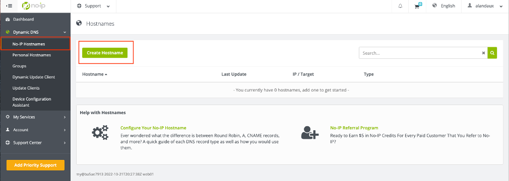
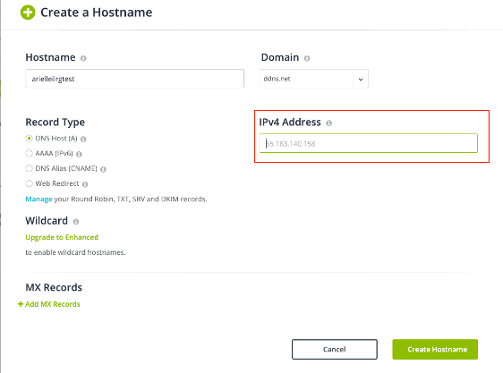
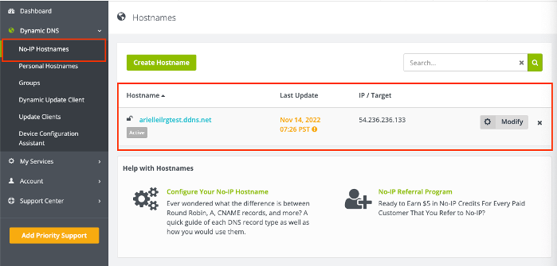

# Instructions for Setting Up on ODK Central

ODK Central is a server option for ODK (Open Data Kit). It stores forms and permissions and allows for the downloading of data collected from ODK. ODK Central is a system that needs to be installed onto a server and is installed with Docker, which manages users and permissions for the server.

Preqrequisites for installing ODK Central is a [running EC2 instance on AWS](AWS_Setup.html).

## Register a Domain
- Create an account with [No IP](https://www.noip.com/), and then log in.
- Under 'Dynamic DNS' on the right panel, under 'No-IP Hostnames', click on 'Create Hostname'.


- In the new window, choose your Hostname and free domain. Under 'IPV4 Address' put the Elastic IP Address that you allocated and associated with you Amazon EC2 server.


- The hostname should now appear under 'No-IP Hostnames', and also list the hostname, and the IP Address associated with you Amazon EC2 server.



## Install ODK Central
[Instructions](https://docs.getodk.org/central-install-digital-ocean/#getting-and-setting-up-central) by Open Data Kit for installing ODK Central. These instructions are repeated and enumerated upon below.


### Connect to the Server
See the [Connecting to the Server](PuTTY_Setup.html) page for instructions on how to connect to the server.


### Configure Server
- Set a root password for your server (you will need it to log into the server in PGAdmin later). After entering the command, you will be prompted to type and then retype a password. In the command line:

    ```
    sudo passwd root
    ```

- Set up and configure [Docker](https://docs.docker.com/engine/install/ubuntu/).

    ```
    sudo apt-get update
    ```
    ```
    sudo apt-get install \
        ca-certificates \
        curl \
        gnupg \
        lsb-release
    ```

    - Type `Y` when asked if you want to continue.

    ```
    sudo mkdir -m 0755 -p /etc/apt/keyrings
    ```
    ```
    curl -fsSL https://download.docker.com/linux/ubuntu/gpg | sudo gpg --dearmor -o /etc/apt/keyrings/docker.gpg
    ```
    ```
    echo \
    "deb [arch=$(dpkg --print-architecture) signed-by=/etc/apt/keyrings/docker.gpg] https://download.docker.com/linux/ubuntu \
    $(lsb_release -cs) stable" | sudo tee /etc/apt/sources.list.d/docker.list > /dev/null
    ```
    ```
    sudo apt-get update
    ```
    ```
    sudo apt-get install docker-ce docker-ce-cli containerd.io docker-buildx-plugin docker-compose-plugin
    ```

    - Type `Y` when asked if you want to continue.
- Test that everyting is working correctly by running a test container:

    ```
    sudo docker run hello-world
    ```

- Configure docker:
    - Set Docker to start up every time the server starts up:
    ```
    sudo systemctl enable docker
    ```
    - Configure the firewall for Enketo features (the preview feature in ODK Central) to work correctly:
    ```
    sudo ufw disable
    ```
    - You should see the message `Firewall stopped and disabled on system startup.`

### Download and Install ODK Central
- Clone ODK Central from github:
```
git clone https://github.com/getodk/central
```
- Navigate to the Central folder to start working with the ODK software just installed from Github.
```
cd central
```
- Install missing components:
```
git submodule update -i
```
- Manually update settings:
    - Move the `.env.template` into the env folder:
    ```
    mv .env.template .env
    ```
    - Edit the file. This command will launch a text editing application:
    ```
    nano .env
    ```
        - Change the `DOMAIN` line so that after the `=` is the domain name you registered with No-IP. For example: `DOMAIN = ilrg.ddns.net`. Do not include anything like 'http://'
        - This domain name will be home how ODK Central is accessed later on.
        - Change the `SYSADMIN_EMAIL` line to your own email. This will allow you to be notified if something is wrong with your security certificate.
    - Hit `CTRL + X` to exit the text editor, then type `Y` to confirm the changes, then press enter to confirm the file name (don't change the file name)
- Tell the system you want the latest version of the database: 
    ```
    touch ./files/allow-postgres14-upgrade
    ```
- Bundle everything together in a server inside a Docker container. This should take a couple of minutes, and you will see a lot of text output.
    - Get Docker up and running
    ```
    sudo docker compose build
    ```
    - Wait a few minutes for the set up to complete, then type:
    ```
    sudo docker compose up --no-start
    ```
- If you get an error that there is no space left on the device use the command:
```
sudo docker system prune
```
- Check that everything is working properly by starting up the server again:
```
sudo docker compose up -d
```
```
sudo docker compose ps
```
- If you encounter any errors, the above code snippets might be out of date, and you should check the [most recent instructions for downloading docker on Ubuntu](https://docs.docker.com/engine/install/ubuntu/) and the [most recent instructions for installing ODK Central on Ubuntu](https://docs.getodk.org/central-install-digital-ocean/#central-install-digital-ocean) .
- The domain name you set up with No-IP and entered when configuring ODK Central can now be visited and should display and ODK Central login page. It might take up for a day for the domain to start working, however.
- Once the domain is working, create an administrator account so you can log in and create new users.
    - Make sure you are in the central folder on your server:
    ```
    cd central
    ```
    - For the following two commands, be careful. Do not copy and paste these directly. You must edit in your e-mail address. It is suggested to use a text editor to do this; copy in these commands, replace the text that is displayed in capital letters with your e-mail, then copy and paste that into your terminal.
    - Type in the following command, substituting your email address:
    ```
    sudo docker compose exec service odk-cmd --email YOUREMAIL@ADDRESSHERE.COM user-create
    ```

  - Enter a password when prompted.
  - Make the account an administrator account, again substituting your email address:
    ```
    sudo docker compose exec service odk-cmd --email YOUREMAIL@ADDRESSHERE.COM user-promote
    ```

You should access ODK Central through the docker whenever you want to add users or edit permissions.

Next, we will go over setting up Webmin, the main user interface used to monitor and configure the databases. 

**[Previous](PuTTY_Setup.html)** <> **[Next](Webmin.html)**
