# Setting Up and Using PGAdmin
PGAdmin is a web-based or desktop application GUI that the ILRG project uses to interact with the Postgres databases through SQL queries. You can also use PGAdmin to perform any sort of database administration required for a Postgres database.

Prerequisites:
- [EC2 server instance](AWS_Setup.html) running Ubuntu 20.04 with [PostgreSQL database instances installed](Postgres_Setup.html)

## Download PG Admin
- [Install](https://www.pgadmin.org/download/) PGADmin as a desktop application
- Choose the version you want to download and click the link, then click on the files to download them
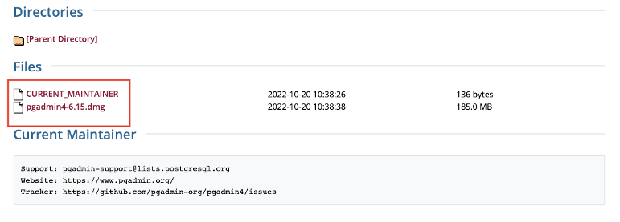
- Once the files have downloaded, click on the pgadmin4 download, a new window should pop up, agree to the license, then move pgAdmin to your applications folder
- Navigate to where you downloaded pgAdmin and open it
- pgAdmin will then ask you to set a master password, make sure you write down and remember this password, then hit ok

## Connect PostgreSQL Server
- On the home page of the desktop application, click on 'Add New Server'
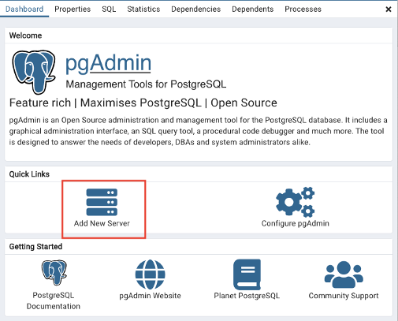
- Connect to the server via an SSH Tunnel, using the key pair that you created when you established the database instance on AWS
    - Under the 'General' tab, name your database
    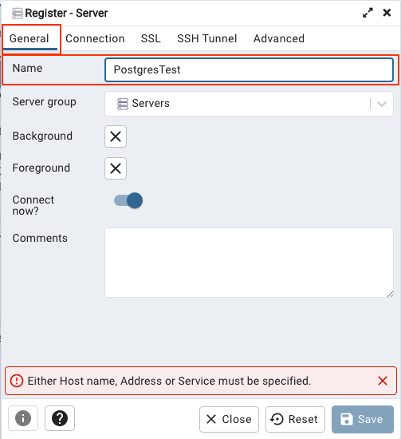
    - Under the 'Connection' tab, set the host to localhost, keep the defaults for everything else
    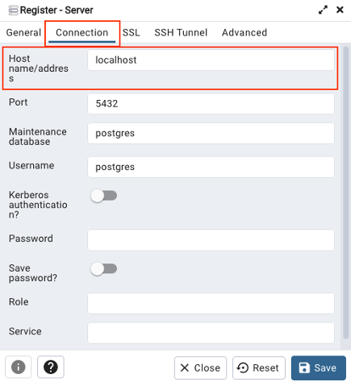
    - Under the 'SSH Tunnel' tab, , the Tunnel host is the Elastic IP address from the AWS EC2 instance, keep the Tunnel port as 22, the Username is ubuntu. Choose the identity file as the Authentication type, and choose the .pem or .ppk file you saved when setting up the server as the Identity file. Then hit save.

        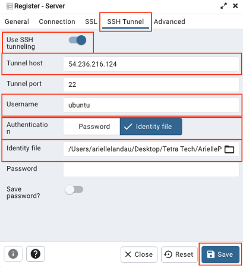
- If the connection was successful, you will see your database and users that you created in the postgres command line in previous steps

    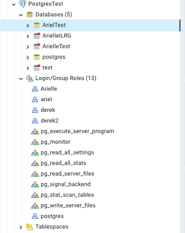

## Create Update and Public Schemas
- Two SQL scripts need to be run to build the update and public schema. These scripts initialize the data tables.
- Download and save [build_public.sql](serverAssets/build_public.sql) and [build_update.sql](serverAssets/build_update.sql)
- Highlight the database where you want to set up the update and public schemas, in this example, it is the 'test' database
    - Then under 'Tools' click on 'Query Tool', this will open the query panel for the test database
    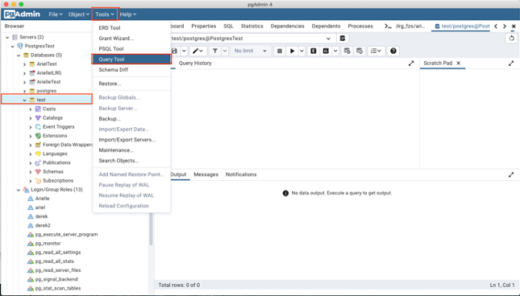
- Click on the folder icon in the top left corner, and in the window that pops up, navigate to where you have saved build_public.sql

    
- You should see the sql script load, then click play to run the script
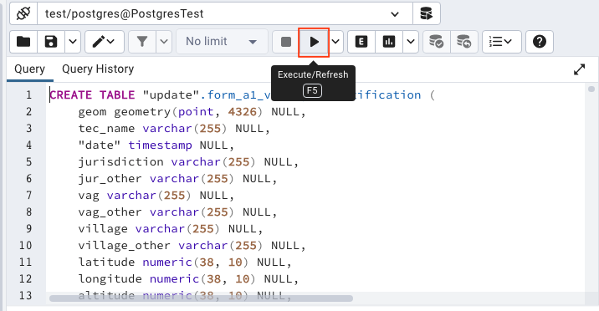
- To make the changes permanent, you need to hit the save icon
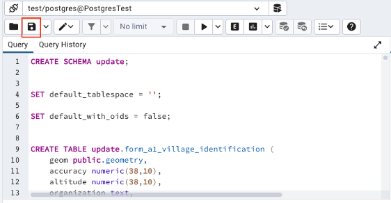
- Repeat the process for build_update.sql, then you should see both the public and update schemas listed under schemas on the side tab

    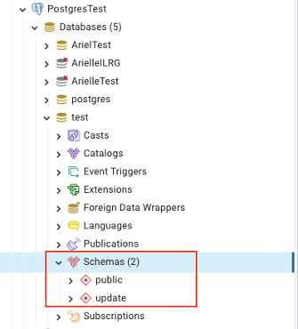

## Create New Roles and Grant Permissions
- On the side panel, under the database where you want to add users or change roles, right click on 'Login/Group Roles', then hit create, then Login/Group Roles

    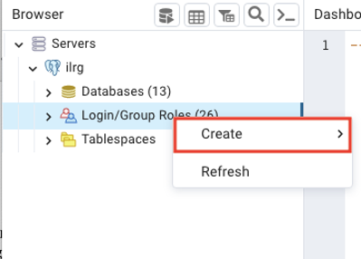   
- Choose a Name under the 'General' tab
- Under definition:
    - Choose a password
    - Set an account expiration if you want
    - Leave connection limit to the default
- Under privileges:
    - Choose the privileges of the user you created, at minimum, the user should be able to login and inherit rights from the parent roles
- Under membership:
    - Decide if the user is part of a group, and designate its parent roles
- Then hit save, you can always adjust permissions by clicking on a user, then going to properties, and toggling different options under the privileges tab (you must be logged into the server as someone with permission to create roles to make these changes)

You should have all the required infrastructure downloaded and working on the server (ODK Central, Webmin and PostgreSQL), with at least one database holding two schemas: public and update. Next, the documentation covers how to use and configure Open Data Kit for collecting customary land documentation data. 

**[Previous](Postgres_Setup.html) <> [Next](Troubleshooting_Server.html)**
