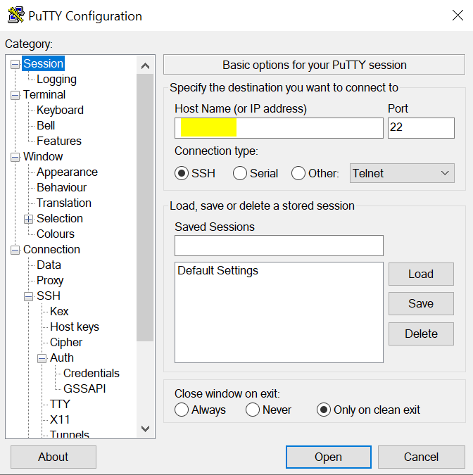
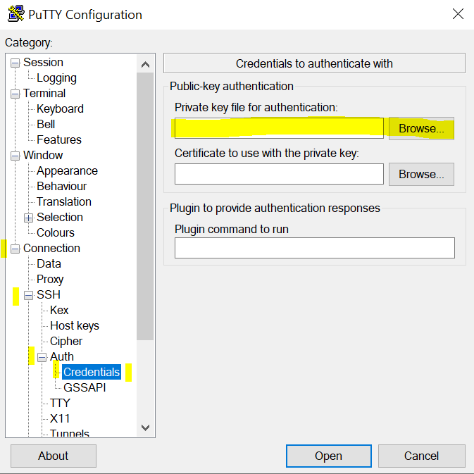
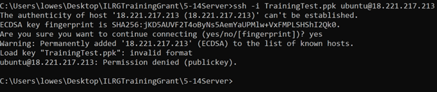
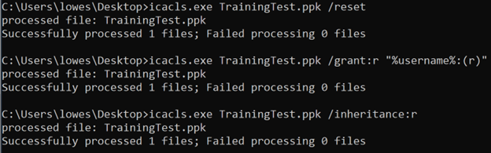

# Connecting to the Server
The required services, including ODK Central, Webmin, and PostgreSQL will now be installed onto our server instance. This will be done through the command line. The easiest way to connect is by using PuTTY, but other methods are also shown below. Any time you are entering commands for your server, you should follow the connection instructions below. Only one connection method is required; choose the one that works best for you.

## Step 0 - Installing PuTTY
PuTTY is a free and open-source terminal emulator, serial console and network file transfer application. To make managing all the data files and databases easier. We use PuTTY for any software installations and for any server configurations. We will need to use PuTTY later on to [log onto the server to install Webmin](/Pages/Server/Webmin_Setup.html).

[Putty for MacOS](https://www.ssh.com/academy/ssh/putty/mac)

[Putty for Windows](https://www.putty.org/)

It is recommended to install PuTTY using [Homebrew](https://brew.sh/):
- In the command line of your computer:
```
brew install putty
```

## Method #1: Log into Server via PuTTY GUI
- The simplest way to connect to your server and input commands is to use the PuTTY graphical user interface (GUI). First, start the PuTTY application by double clicking the icon wherever you installed it, through the start menu, or by running putty.exe in your terminal.
- The PuTTY window will open. The first step is to input your server's IP address in the box that says "Host Name (or IP Address)". This window is shown below, with the correct text box highlighted. 

- Next, expand the "Connection" category on the sidebar. Then, expand "SSH", then "Auth", until you can click "Credentials".
- The credentials screen is shown below. Click on "Browse" to locate your .pem or .ppk key file, and select it.

- Finally, click the "Open" button on the bottom of the window to open the connection. A terminal or command line window will open. You will know are connected to the server if you see the username and IP address for your server. This means you can start inputting commands, and can continue to the next page of the documentation.

## Method #2: Log into Server via Terminal Command Line
- This is another method commonly used by more advanced users (or users who are more comfortable using the command line). It is fairly simple and should be learned by anyone who will be in charge of this type of system, but can have some common problems related to permissioning on the keys. Methods to troubleshoot these issues are enumerated below. 
- First navigate in your terminal to the folder where you stored your .ppk or .pem file using ```cd``` commands.
    - For example, if your .ppk or .pem key is in your downloads folder, type this into the terminal: ```cd Downloads```, if the key is in a folder on your desktop: ```cd Desktop/folder1/folder2```.
- To log in use the following command, it is likely that your username is ubuntu: 
```
ssh -i puttyCode.ppk user@hostname
```
    - Example: 
    ```
    ssh -i ilrg_server_2.pem ubuntu@13.244.91.45
    ```
### Method #2 - Common Windows Errors and Troubleshooting
- You may see an "invalid format" or "Permission denied (publickey)" error on Windows operating systems. This has to do with the fact that the key needs to be read-only for the user, which by default it may not be after downloading it from AWS. This error is shown below. 

- There are a few ways to fix this, some of which depend on which version of Windows is being run. Using icacls.exe, a Windows command line utility, is the simplest method and will be shown below. Other methods include changing the Permissions using the Windows GUI (by right-clicking the file and going to permissions), and using PuTTY to export an OpenSSH key from the key file you downloaded. However, these methods are dependent on which version of Windows or PuTTY is being used; use online resources to learn more.
- To use the icacls.exe method, copy the following commands into your editor, then re-try the connection. Replace the KEYNAME.PPK in capitals with the file name for your key.
```
icacls.exe KEYNAME.PPK /reset
```
```
icacls.exe KEYNAME.PPK /grant:r "%username%:(r)"
```
```
icacls.exe KEYNAME.PPK /inheritance:r
```

- Then, try to connect using the "ssh -i KEYNAME.ppk user@hostname", as above.

### Method #2 - Common Linux and Mac Error and Troubleshooting
- If you get an error like this: `Permissions 0644 for 'documentation.pem' are too open.
It is required that your private key files are NOT accessible by others.
This private key will be ignored.` try using the `chmod 400` command to modify permissions of the .pem or .ppk key.
    ```
    chmod 400 fileName.pem
    ```
    - Example: 
    ```
    chmod 400 AriellePostgresTest.pem
    ```
- Then try to log in again with ssh.


## Method #3: Connect on AWS Console
- This method is not recommended. It allows you to use a web-based command line to connect to your sever. However, some functionality is limited. It can be good for practice, or by running small, simple commands. 
- Go to 'EC2' > 'Instance' and then click on the instance you just created, then click 'Connect'.


- On the 'EC2 Instance Connect' tab, click 'Connect'.


- A new tab will pop up with the server's console.


**[Previous](AWS_Setup.html) <> [Next](ODK_Central_Setup.html)**
