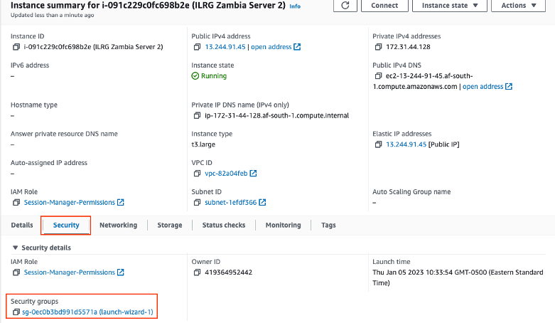
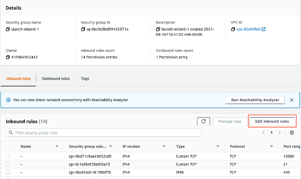
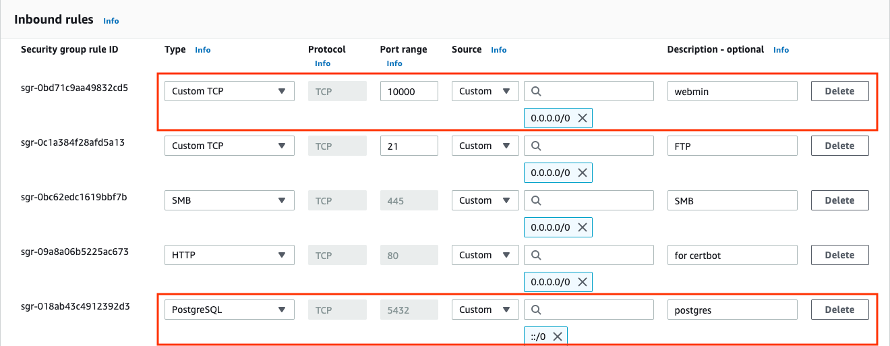
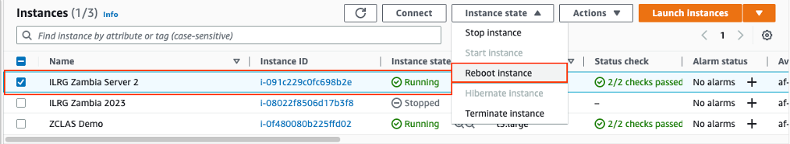
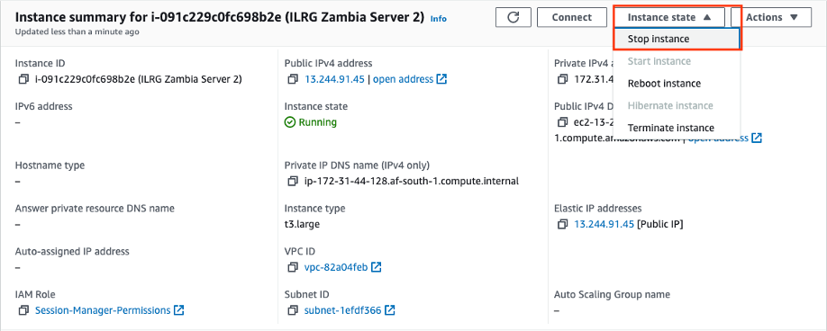
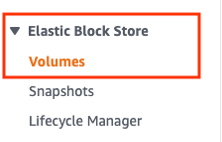
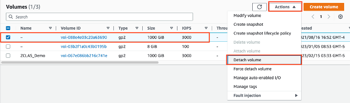
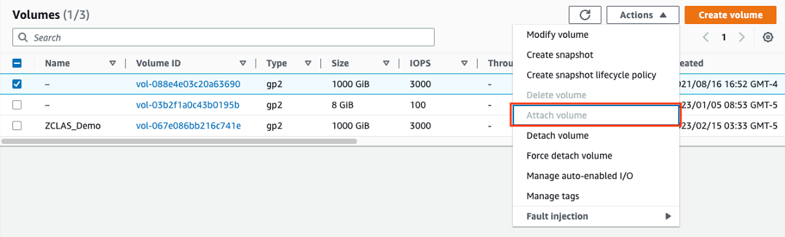

# Troubleshooting Server Issues

## Open and Check Ports
If there are issues connecting to Webmin, ZCLAS or the Postgres databases, you should first check that the proper ports are open. 

- Log in to AWS, and go to the EC2 instance. Under 'Security', click on 'Security groups'.


- Then click 'Edit Inbound Rules'.


- Check that ports such as 5432 (for postgres) and 10000 (for webmin) are open. You want to check the port for whatever service you are unable to connect to.



## Reboot Instance
- A quick solution is to try and reboot the instance.
- Log into AWS and go to the EC2 Instances. Highlight the instance you want to reboot. Then under ‘Instance State’ choose ‘Reboot instance’.



## Check Systems are Enabled
Sometimes services like Tomcat and Nginx that are required for parts of the ILRG system become disabled. Checking that services you need are enabled is another important step in troubleshooting why part of the system might have broken down. 

- Log into the server command line using your preferred method.
- Then run the following command:
```
systemctl list-unit-files
```
- Enable any systems that should be enabled, but are listed as disabled by using the command:
```
systemctl enable –-now service
```
    - For Example: 
    ```
    systemctl enable --now webmin.service
    systemctl enable --now docker.service
    ```

## Detach Volume and Run Rescue Instance
A last resort is detaching the volume of the server from the current instance, and then reattaching it to a rescue instance. 
- First, set up a rescue instance (another EC2 instance with the same set up as the current EC2 instance). Make sure to save the .ppk key created with the new instance as you will need it to log into the rescue instance later on.
- Temporarily stop the current server. By going to the instance in AWS, then clicking on ‘Instance State’, then stop Instance. 


- Go to the ‘Volumes’ page via the left side panel. Detach the volume by first highlighting the volume, then going to ‘Actions’, ‘Detach Volume’. 




- Then re-select the volume, and go to ‘Actions’ then ‘Attach Volume’, and then choose the instance you just created.  


- Log into the new server using PuTTY and the .ppk key you saved from a previous instance.
- Use a chroot environment to trouble shoot the original instance by accessing its information through the rescue instance using the following commands:
```
rescuedev=/dev/nvme1n1p1
rescuemnt=/mnt
mount $rescuedev $rescuemnt
for i in proc sys dev run; do mount --bind /$i $rescuemnt/$i ; done
chroot $rescuemnt
```
- Review the logs from the root value to look for any errors or failures. Then check to see if services such as ssh and Postgres are enabled. 
- Run the following command to see which services are enabled/disabled:
```
systemctl list-unit-files
```
- Make sure ssh is enabled:
```
systemctl enable –-now ssh.service
```
- Enable any other services required.
- Now you can stop the rescue instance. And then detach and reattach the volume to the original instance. And then restart the original instance (following a similar process to the previous steps). 

**[Previous](PGAdmin.html)** <> **[Next](/Pages/ODK/Open_Data_Kit.html)**
