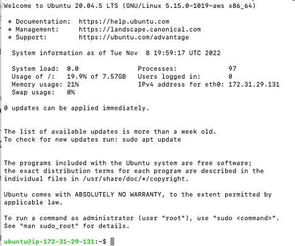
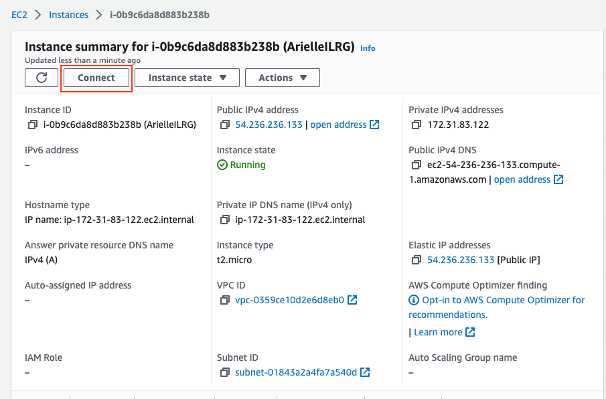
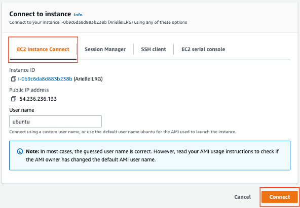
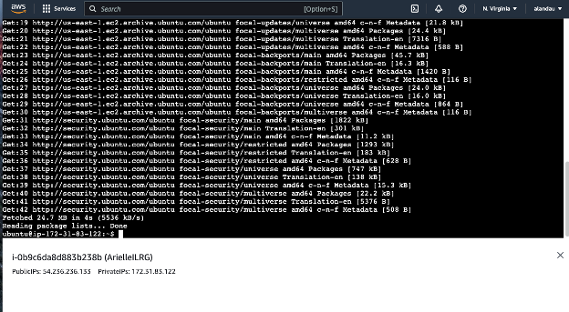
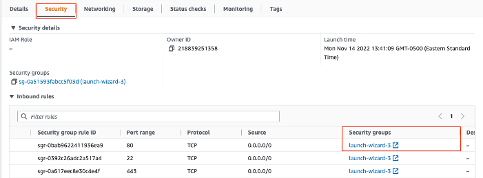
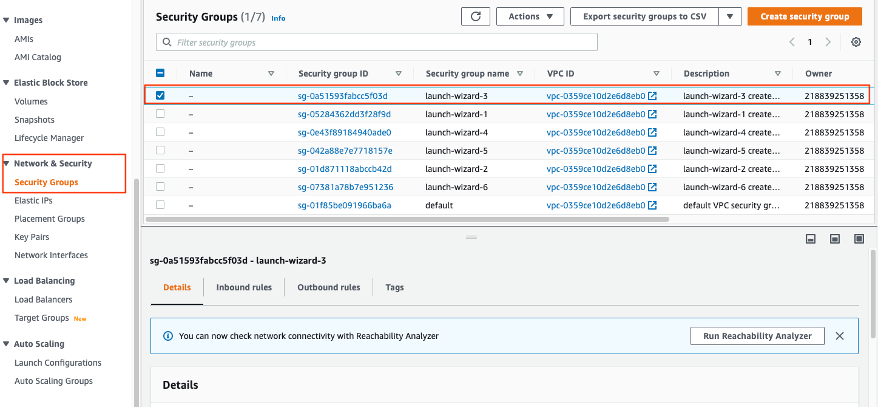
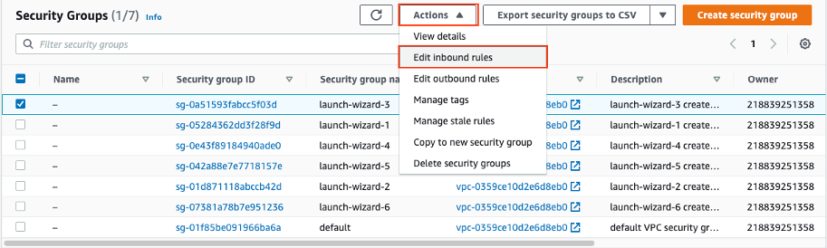
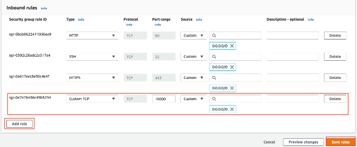
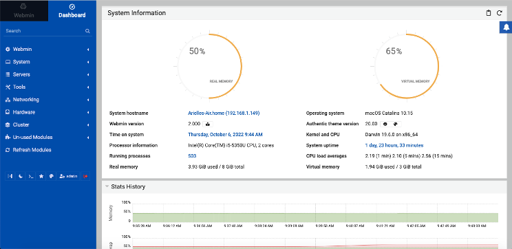

# Instructions for Setting up Webmin
Webmin is a configuration tool used to manage Linux systems. It automatically updates your configuration files when you perform tasks using its web interface, such as linking postgres databases. Webmin can also be used to run cron jobs - automatically runs scripts and commands.

For further questions beyond this documentation, consult the [Webmin Documentation Wiki](http://doxfer.webmin.com/Webmin/Main_Page)

A prerequisite for setting up Webmin is a [running Amazon EC2 Instance](AWS_Setup.html).

## Connect to the Server
There are two options to connect to the server, you can log onto the server via your computer's terminal, using a key-pair, or you can use the console that AWS provides.

#### **Connect on your Computer's terminal**
- [PuTTY needs to be installed](PuTTY_Setup.html) to make changes to the server instance and to log in to the server
- First, navigate to where you stored your .ppk or .pem file (from when you created the EC2 instance). For example, in the command line:
```
cd Desktop/TetraTech
```
- Log in to PuTTY with the .ppk key (.pem key on mac). The user will be ubuntu, as that is the default for EC2 instance running Ubuntu. The hostname is the IP address for our EC2 instance (the same one you used to register the domain), which you can find under the instance summary in your AWS console. In the command line:
```
ssh -i yourSSHKey.ppk user@hostname
```
example:
```
ssh -i ILRG-test.pem ubuntu@18.211.191.151
```
- If these commands are successful, the terminal should look something like this:

    
- Note the green font and the start of the command line which should list the username and then the private IP address for the server
    - This confirms that you are running commands within the server

#### **Connect on AWS Console**
- Go to 'EC2' > 'Instance' and then click on the instance you just created, then hit 'Connect'

    
- On the 'EC2 Instance Connect' tab, click 'Connect'

    
- A new tab will pop up with the server's console

    

## Install Webmin
- Update and upgrade packages
```
sudo apt update
sudo apt upgrade
```
    - Type `Y` when asked if you want to continue
- Install dependency packages:
```
sudo apt install software-properties-common apt-transport-https
```
    - Type `Y` when asked if you want to continue
- Download the Webmin PGP key with wget and add it to your system's set of keys
```
wget -q -O- http://www.webmin.com/jcameron-key.asc | sudo apt-key add -
```
    - You should see a message: `OK`
- Manually add the Webmin repository:
```
sudo add-apt-repository "deb [arch=amd64] http://download.webmin.com/download/repository sarge contrib"
```
- Start the Webmin application:
```
sudo apt install webmin
```
    - Type `Y` when asked if you want to continue
- Configure the firewall and then reload it for the changes to take effect
```
sudo ufw enable
sudo ufw allow 10000/tcp
sudo ufw reload
```
- Check the status of the firewall to confirm changes, you want the line with `10000/tcp (v6) to allow from anywhere`
```
sudo ufw status
```
- Set admin password:
```
sudo /usr/share/webmin/changepass.pl /etc/webmin root yourpassword
```

## Configure AWS For Webmin
- We need to edit the security groups for the EC2 instance so that Webmin can communicate with the server
- Navigate to the EC2 instance on AWS, then click on the 'Security' tab and note the security group, in this example, the security group is launch-wizard-3


- Then in the left panel, navigate to 'Security Groups' under 'Network & Security'. Then click the check box on the Security Group for your instance


- Click on 'Actions' and then 'Edit Inbound rules'


- Click 'Add rule' and fill out a new role with type 'Custom TCP', Port range 10000, Source 'Anywhere' 0.0.0.0/0. Then hit 'Save rules'.


- You should be able to visit your Webmin page through the web using the server's IP: https://[your server's IP]:10000/
    - to login, use the username ubuntu and the admin password you set for the server earlier on
-The Webmin home page should look something like this:



**[Navigating the Webmin Interface](../NavigatingWebmin.html)**

**[Previous](ODK_Central_Setup.html)** <> **[Next](Postgres_Setup.html)**
