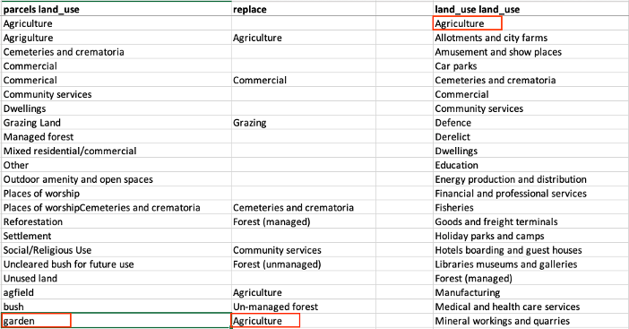

# Admin Database and ZCLAS Maintenance

The Admin database holds only complete and validated parcel and party data. It is also specifically organized to communicate with the ZCLAS database and its requirements. ZCLAS uses its own system of reference tables and standardized values, so the data coming into the Admin database must be cleaned, otherwise that data will fail when it is migrated to ZCLAS.

## Important Scripts
- [database_creation.sql](/Pages/ZCLAS/ZCLAS_Assets/database_creation.sql)
    - creates all of the necessary tables in the public schema as well as triggers to track a history of changes
    - adds initial data and roles with appropriate permissions, also enumerates workflow steps
    - details reference tables, and accepted values
        - Example for aqcuisition type:
        ```
        -- Acquisition types
        INSERT INTO public.ref_acquisition_type(code, val) VALUES ('allocated_chief', 'Allocated chief');
        INSERT INTO public.ref_acquisition_type(code, val) VALUES ('allocated_cust_auth', 'Allocated customary authority');
        INSERT INTO public.ref_acquisition_type(code, val) VALUES ('allocated_government', 'Allocated by government');
        INSERT INTO public.ref_acquisition_type(code, val) VALUES ('bought', 'Bought');
        INSERT INTO public.ref_acquisition_type(code, val) VALUES ('cleared', 'Cleared without permission');
        INSERT INTO public.ref_acquisition_type(code, val) VALUES ('gifted', 'Gifted');
        INSERT INTO public.ref_acquisition_type(code, val) VALUES ('inherited', 'Inherited');
        INSERT INTO public.ref_acquisition_type(code, val) VALUES ('other', 'other');
        INSERT INTO public.ref_acquisition_type(code, val) VALUES ('other_not_listed', 'Other not listed');
        ```
    - loads geospatial data of Villages, Chiefdoms and Provinces
- [data_clean.sql](/Pages/ZCLAS/ZCLAS_Assets/data_clean.sql)
    - runs commands to delete data from some of the parent and child tables, but does not delete the tables themselves.
- [migration.sql](/Pages/ZCLAS/ZCLAS_Assets/migration.sql)
    - moves data from the admin database to the ZCLAS database and keeps a log of any errors that occur
    - includes checks such as if parcels have parties associated with them and if values correspond to those in reference tables

## Matching Values to Reference Tables
- When validated data is added to the Admin Database, it still needs to be cleaned so that all of the values match the reference tables for ZCLAS. This is basically a process in standardizing the data so that each set of data, even when they are from different projects and enumerators. 
- There is a sheet for each value that has a corresponding reference table
- Column titles are the name of the table followed by the column name
    - Column A lists examples of values before cleaning, while Column B lists what those values should be replaced with
    - Column D are the values in reference tables.
    - For example, if land_use = ‘garden’, that value needs to be replaced to ‘Agriculture’. We replace ‘garden’ with ‘Agriculture’ as it is the closest corresponding value in the reference table



## SQL Scripts to Solve Common Migration Errors
- Use the query tool in PGAdmin to run the following scripts
- The most common errors stem from values that do not exist in reference tables. You can use the following SQL script to see how many records have each value, and then compare those values to Column D in the proper sheet
```
SELECT value, COUNT(value) FROM table GROUP BY value;
```
    - Example: to see the values for land_cover in the parcels table, this query will show how many parcels have each value
    ```
    -- see how many parcels have each value
    SELECT land_cover, COUNT(land_cover) FROM parcels GROUP BY land_cover;
    ```
- Values that need to be changed can be updated
```
UPDATE table
SET value = new_value
WHERE value = old_value;
```
    - Example: updates the parcels table and replaces land_use with ‘Agriculture’ when land_use = ‘Medicinal Plants’
    ```
    UPDATE parcels
    SET land_use = 'Agriculture'
    WHERE land_use = 'Medicinal Plants';
    ```
    - Example: you can also update multiple fields at once when a value needs to be replaced by the same new value
    ```
    UPDATE tenure
    SET tenure_acquired = 'Gifted'
    WHERE tenure_acquired = 'Give by herself'
    OR tenure_acquired = 'Given by friend'
    OR tenure_acquired = 'Given by her self'
    OR tenure_acquired = 'Given by herself'
    OR tenure_acquired = 'Given by himself';
    ```
- Insert new data:
```
INSERT INTO table1(column1, column2, column3, column4)
SELECT *
FROM dblink('host=13.244.91.45 user=username password=password dbname= database_name,
'SELECT table2.column1 table2.column2, table2.column3, table2.column4
FROM table2)
AS x(column1 character varying, column2 character varying,
column3 character varying, column4 character varying);
```
    - Example:
    ```
    -- for tgcc_cdla
    INSERT INTO witness_tmp(key_id, parcel, party_id, given_name, family_name)
    SELECT *
    FROM dblink('host=13.244.91.45 user=username password=password dbname= tgcc_cdla',
    'SELECT demarcation_witnesses.parent_key, demarcation_witnesses.upn,
    demarcation_witnesses.key, demarcation_witnesses.name_given,
    demarcation_witnesses.name_family
    FROM demarcation_witnesses')
    AS x(key_id character varying, parcel character varying,
    party_id character varying, given_name character varying, family_name character varying);
    ```
- Insert missing data:
```
INSERT INTO table1(column1, column2, column3, column4)
SELECT *
FROM dblink('host=13.244.91.45 user=username password=password dbname= database_name,
'SELECT table2.column1, table2.column2, table2.column3, table2.column4
FROM table2')
AS x(column1 character varying, column2 character varying,
column3 character varying, column4)
WHERE column1 NOT IN(SELECT column1 FROM table1);
```
    - Example: inserts data into parcel_applicant from the tgcc_cdla database when the parcel data is in the parcels table but does not have party data in the parcel_applicant table
    ```
    INSERT INTO parcel_applicant(parcel, party_id, first_name, 
    family_name, year_of_birth, id_doc_number, party_role)
    SELECT *
    FROM dblink('host=13.244.91.45 user=username password=password dbname= tgcc_cdla',
    'SELECT claims.upn, claims.cal_key,
    claims.given_name, claims.family_name, 
    claims.yob, claims.nrc, 
    claims.relationship_land 
    FROM claims')
    AS x(parcel character varying, party_id character varying,
    first_name character varying, family_name character varying, 
    year_of_birth character varying, 
    id_doc_number character varying, party_role character varying)
    WHERE parcel IN(SELECT parcel_name FROM parcels)
    AND parcel NOT IN(SELECT parcel FROM parcel_applicant);
    ```

**[Previous](ZCLAS_Intro.html)**